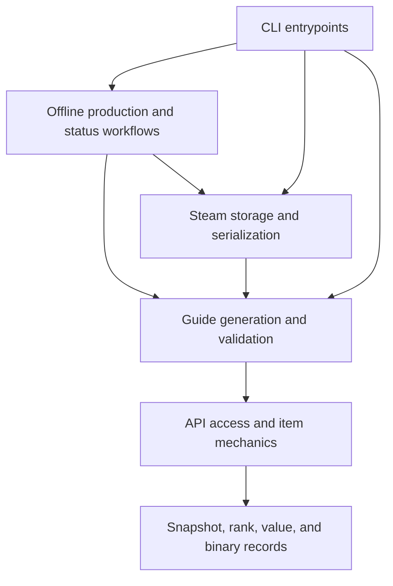

# Python module boundaries

This CLI collects evidence, builds purchase guides, and installs reviewed builds
in Steam. The dependency rules protect those responsibilities without adding
services, a dependency injection framework, or new Python packages.

The design follows roadmap.sh's guidance on boundaries, coupling, cohesion, and
keeping code simple. Python modules provide the boundaries; Tach checks their
imports before release. The existing typed records remain the data contracts.
See the [design roadmap](https://roadmap.sh/pdfs/roadmaps/software-design-architecture.pdf),
[system design roadmap](https://roadmap.sh/system-design), and
[Python roadmap](https://roadmap.sh/python).

## Dependency direction

The six layers below are ordered from callers to dependencies. An arrow shows
an allowed direction, not permission for every possible import. Every dependency
must also appear in `depends_on`.

| Layer | Owners | Enforced boundary |
| --- | --- | --- |
| `entrypoints` | `cli.py` and `cli_*` | CLI dispatch and output can call lower layers. Lower layers cannot import CLI code. |
| `workflows` | `offline`, `freshness`, `steam_identity` | Only `cli.py` can import the offline producer, through `refresh.main`. Status code has read access to the cache. |
| `storage` | `cache`, cache implementation files, `protobuf` | Guide code cannot call Steam storage. Cache implementation files are visible only within the cache boundary. |
| `runtime` | Remaining `deadlock_build_sync` files | Generation, evidence admission, planning, descriptions, and artifact validation can use inputs and shared records. They cannot import storage, workflows, or CLI modules. |
| `inputs` | API client, HTTP client, API records, mechanics files | Input code cannot import guide generation or installation code. Each input module has its own dependency list. |
| `foundation` | `snapshot`, `ranks`, `value_validation`, `cache_types`, `kv3_binary` | Shared records and the binary codec cannot import higher layers. |

The workflow layer contains separate components. Its position does not let the
offline producer import Steam storage: that dependency is absent from its exact
list. The status workflow can inspect installed builds but cannot import the
installation or restore functions.

## Public interfaces

`cache.py` exposes discovery, reading, and result types to its consumers.
`install_guides` is visible only to `cli_support`, which owns the install call.
`restore_latest` is visible only to `cli_export`, which owns the restore call.
Consumers cannot import cache implementation files to avoid these interfaces.

The offline producer exposes only `refresh.main` to the main CLI. Its internal
discovery and fitting functions remain private to that component. Runtime code
does not import optional analysis dependencies through the producer.

These are static import rules. Existing runtime checks still own purchase
legality, artifact admission, process detection, backups, validation, and atomic
replacement. Tach does not replace those checks.

## Scope and maintenance

[tach.toml](../tach.toml) declares 35 module boundaries. It checks all files under
`src`, including imports under `TYPE_CHECKING`. Every declared dependency must
be used. Upward imports, undeclared imports, cycles between declared modules,
unused ignore directives, and ignore directives without reasons are errors.
No module is unchecked or a globally available utility.

The runtime component still contains 83 files, including policy and planner
internals. Tach does not check dependency cycles inside that component. Splitting
it needs changes to existing internal cycles and a separate ownership decision;
this configuration does not claim to remove those cycles.

The source root remains `src`. Tach 0.35 gives ambiguous module identities with
overlapping `src` and repository roots. The packaged narrative script therefore
remains outside this Tach graph; Deptry, typing, lint, and coverage still check it.

Run `uv run tach check` locally. CI runs the same command. Do not use `tach sync`
to accept an import without review. For an intended dependency change, check the
owner and direction, update the exact dependency list, then run the check.
Keep `layers_explicit_depends_on = true`: layers alone would otherwise permit
undeclared imports into lower layers. See the [Tach layer rules](https://docs.gauge.sh/usage/layers/)
and [interface rules](https://docs.gauge.sh/usage/interfaces/).
