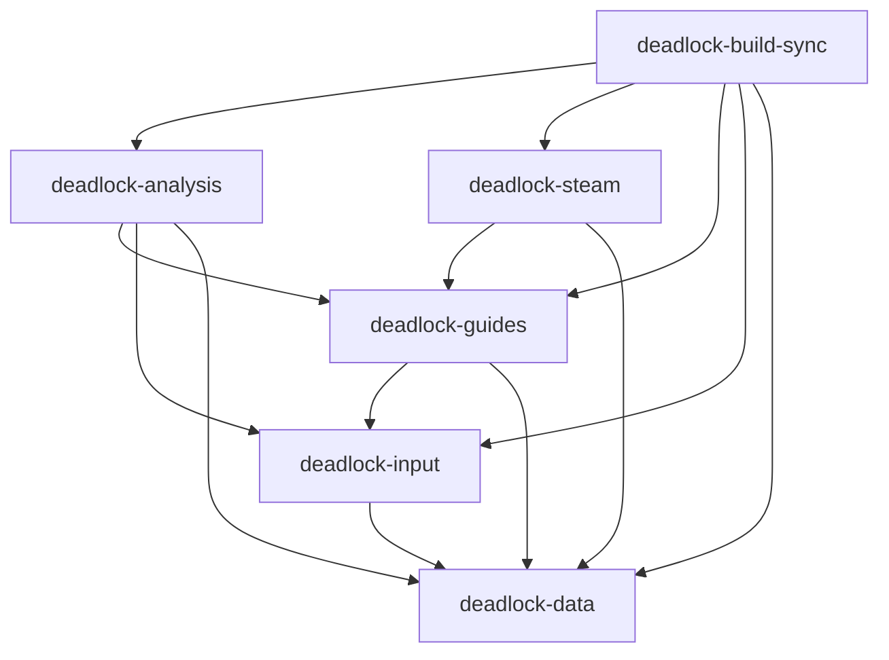

# Architecture

The CLI separates evidence collection, guide generation, numerical analysis, and Steam storage.
All repository code uses synchronous operations.
The application uses standard threads for independent analysis jobs and API requests.
It preserves input order when it collects their results.

## Dependency direction

An arrow identifies an allowed project dependency.

| Crate | Responsibility | Allowed project dependencies |
| --- | --- | --- |
| `deadlock-data` | Validation, canonical JSON, fingerprints, ranks, snapshots, artifacts, statistics, and tracing | None |
| `deadlock-input` | Synchronous HTTP, source recording, API records, item mechanics, and API account names | Data |
| `deadlock-guides` | Evidence admission, abilities, purchase planning, policies, descriptions, presentation, and replay reports | Data and inputs |
| `deadlock-steam` | Steam discovery, KV3, protobuf, backups, installation, and recovery | Data and guides |
| `deadlock-analysis` | Source extraction, exact-core discovery, numerical estimates, and evidence production | Data, inputs, and guides |
| `deadlock-build-sync` | Argument parsing, workflow control, artifact transactions, and output | The five product libraries |

The CLI enables the optional `analysis` dependency through its `analysis` feature.
The default CLI excludes the database and numerical producer.
Guide generation cannot import the producer or Steam storage.
Analysis cannot import Steam storage.
Review normal, build, and development dependencies against this table.
Review module dependencies for cycles.
`arch-lint.toml` enforces crate boundaries in imports and inline qualified paths.
It also blocks network and database access in guide logic.
CI and local verification call Arch-lint 0.6.0 directly.
Warnings fail the check.
Review source-selection changes to retain complete Rust source coverage.

Arch-lint uses syntax analysis.
Its scope dependency rules assume a single `src/` directory and do not resolve workspace crate imports.
The workspace therefore uses explicit `restrict-use` rules for each crate.
Cargo rejects invalid crate dependency cycles.
Cargo metadata and the optional Cargo Modules command support manual dependency review.
The [quality gates](quality-gates.md) distinguish automatic checks from review requirements.

## Public interfaces

Each library exports its reviewed interfaces through `lib.rs`.
Implementation modules remain private.
Internal consumers use module imports with explicit dependency directions.
Public records validate identifiers, completeness, numeric bounds, and related fingerprints at their admission boundaries.

`DeadlockApi` owns synchronous HTTP requests and exact response recording.
Request workers share one rate limiter and connection pool.
They return response records in source order.
The input crate owns an optional response cache beside the evidence file.
Cache keys include the API URL, request parameters, client version, and epochs.
Cache admission checks response hashes and timestamps.
Responses expire after one hour.
Asset and patch requests always contact the API.
`ItemGraph` owns item components, upgrade relationships, mechanics, and inventory restrictions.
`BuildEvidenceCatalog`, `StrategyContext`, `PolicyArtifact`, and `NarrativeCatalog` admit the application artifacts.
Guide functions produce validated policies, deterministic descriptions, purchase routes, and presentation records.
Display grouping follows evidence admission and retains each source evidence group identifier.
Within each source group, the first purchase and imbue target determine display partitions.
The frozen selection rank determines each main path and variant order.
Alternative panels divide complete purchase paths into a shared prefix and separate continuations.
The prefix comparison retains purchase costs, consumed components, inventory order, and imbue targets.
Standalone builds retain paths without a valid prefix or continuation.
Presentation validation requires the complete panel sequence, exact item records, dimensions, and queue flags.
Only `MAIN CORE` enters the automatic purchase queue.

`refresh_evidence` is the numerical producer entry point.
Its `RefreshRequest` contains the fixed cohort, generator, worker count, extraction resources, output location, and resume options.
`ExtractionResources` supplies positive decimal-megabyte and thread limits through DuckDB configuration.
Extraction defaults remain 12 GB and eight threads, independently of hero workers.
The producer stores its source snapshot before discovery.
Resume checks require unchanged source files, nominations, guide groups, cohort settings, and implementation identity.

The producer embeds 51 SQL files with `include_str!`.
SQL loading does not depend on the working directory.
Queries bind values instead of formatting user input into SQL.
Each hero worker has a separate DuckDB connection, one database thread, and a 512 MiB database memory limit.
Workers take jobs from a shared queue and return results in source order.
Validation starts larger estimated workloads first, using frozen candidate counts and discovery support.
Branch validation indexes immutable source rows and reuses identical model inputs within each hero.
Row visitors stream JSON records for large purchase and decision queries.
The decision SQL selects only the 23 fields used by the checkpoint projection.
After discovery freezes the cores, analysis collects their ability responses during numerical validation.
This collection does not change nominations or admission decisions.
Guide generation selects and validates ability paths from those exact cached responses.
Missing or expired responses require fresh API requests.
Malformed responses fail admission.

## Steam storage boundary

`prepare_cache_update` constructs and validates the complete replacement without writing Steam files.
The request carries validated presentation, snapshot, policy, and hero coverage identities.
The planner preserves unrelated values and rejects ambiguous managed paths or shared private build identifiers.

`install_cache_update` owns process checks, concurrency checks, backup creation, temporary validation, and atomic replacement.
`restore_latest` validates the backup and creates a recovery backup before restoration.
Both functions require process inspection through `ProcessInspection`.
The CLI always supplies `LinuxProcesses`.
An unavailable process list prevents a write.

The KV3 codec preserves value types, flags, blobs, object order, and unrelated sections.
It bounds nesting, decoded size, collection counts, and decompression.
The decoder supports binary versions 0 through 5.
The encoder uses version 4 unless an entity-name flag requires version 5.
Prost encodes the known hero-build schema.
A bounded metadata reader inspects existing messages without replacing unrelated protobuf bytes.

## Application artifacts

Artifact generation remains separate from Steam transactions.
The CLI writes a staged bundle, admits the complete artifact chain, and then commits the replacement.
The transaction stages generated files before copying retained files.
It preserves historical builds and unrelated files without copying files that generation replaces.
A failed commit restores the previous bundle or retains its recovery location.
Managed Steam updates are idempotent.
Compatible deterministic descriptions are reusable.

Full-roster selection shares immutable evidence catalog storage through `Arc`.
A selected hero subset receives a new evidence identity and retains the parent identity in `source_artifact_id`.
The subset must pass the complete coverage validator.
Selection does not weaken fingerprint or coverage checks.

## Reference

The [package decisions](rust-package-research.md) record dependency scope and maintenance evidence.
The [quality gates](quality-gates.md) define required checks.
The [Rust verification report](rust-rewrite-verification.md) records migration checks and limitations.

The Python reference remains in Git at `d603d6b53bb110d0ac48a689f037861e6453b243`.
Historical reports describe that implementation unless their text identifies the Rust workspace.
