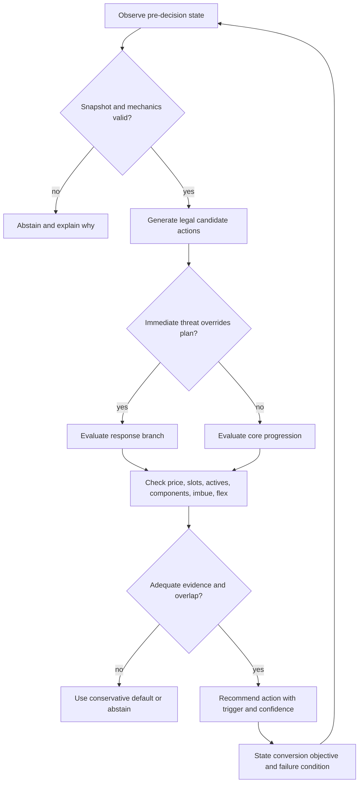
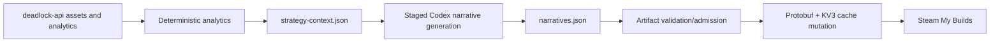
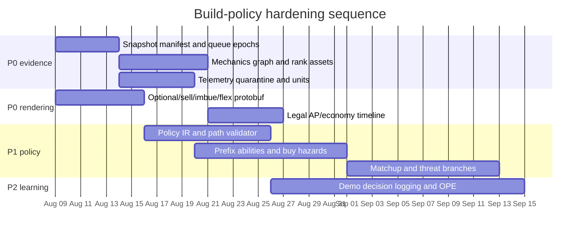

# Designing evidence-grounded MOBA hero builds

> [!IMPORTANT]
> A high-quality build is **not a ranked shopping list**. It is a patch-specific, cohort-specific, state-conditioned policy: given this hero, kit, inventory, economy, allies, enemies, objectives, and game state, recommend the next legal action—or explicitly abstain.

This report answers what a build author or build-generation system should examine when creating a hero build, with particular attention to Deadlock: item win rates, situational and counter items, hero matchups, counter picks, net-worth buy windows, ability scaling and upgrade order, duration-conditioned performance, power spikes, inventory pressure, and safe installation. It also audits the present `deadlock-build-sync` implementation and translates the research into a concrete architecture and roadmap.

Implementation is governed by the companion [build-policy requirements](deadlock-build-policy-requirements.md), which translate this rationale into stable, testable obligations and verification evidence.

The repository was updated with `git pull --ff-only` before research. It was already current at commit [`14076610`](https://github.com/sxndmxn/deadlock-build-sync/tree/14076610aa4d2103df14a307ed195efc19d04ba5). No live Steam sync was run. Four pre-existing working-tree modifications in narrative-generation code and tests were treated as user work and left untouched.

## Table of contents

- [Executive conclusions](#executive-conclusions)
- [Research method and evidence record](#research-method-and-evidence-record)
- [The right abstraction: a build is a policy](#the-right-abstraction-a-build-is-a-policy)
- [Claim classes and evidence hierarchy](#claim-classes-and-evidence-hierarchy)
- [Freeze patch, client, queue, cohort, and analytic grain](#freeze-patch-client-queue-cohort-and-analytic-grain)
- [Deadlock mechanics every build must encode](#deadlock-mechanics-every-build-must-encode)
- [Model the hero kit before choosing items](#model-the-hero-kit-before-choosing-items)
- [How to reason about items](#how-to-reason-about-items)
- [Item win rates: useful signal, dangerous ranking](#item-win-rates-useful-signal-dangerous-ranking)
- [Purchase timing and net-worth windows](#purchase-timing-and-net-worth-windows)
- [Power spikes and game-time performance](#power-spikes-and-game-time-performance)
- [Ability order and ability scaling](#ability-order-and-ability-scaling)
- [Hero matchups, counter picks, and team composition](#hero-matchups-counter-picks-and-team-composition)
- [Counter purchases and situational branches](#counter-purchases-and-situational-branches)
- [Lessons from Dota 2, League of Legends, and research](#lessons-from-dota-2-league-of-legends-and-research)
- [A statistically defensible analysis design](#a-statistically-defensible-analysis-design)
- [The build policy intermediate representation](#the-build-policy-intermediate-representation)
- [Guide rendering and Steam schema semantics](#guide-rendering-and-steam-schema-semantics)
- [Evaluation and monitoring](#evaluation-and-monitoring)
- [Audit of the current repository](#audit-of-the-current-repository)
- [Recommended implementation roadmap](#recommended-implementation-roadmap)
- [Worked examples](#worked-examples)
- [Authoring and release checklists](#authoring-and-release-checklists)
- [Reproducibility record](#reproducibility-record)
- [Source index](#source-index)
- [Glossary](#glossary)

## Executive conclusions

The research supports the following decisions.

| Priority | Finding | Consequence for a build system |
|---:|---|---|
| P0 | A build is a conditional sequence, not 32 independently popular items. | Represent core actions, choices, replacements, sells, waits, and counter branches before rendering a Steam guide. |
| P0 | Patch title alone does not identify a coherent data regime. | Pin client version and asset hashes; record mechanics, matchmaking, map/objective, and telemetry epochs separately. |
| P0 | Standard and Ranked are different populations. Omitted `match_mode` mixes them. | Never label mixed data as one queue. Produce queue-specific policies or an explicitly weighted pooled policy. |
| P0 | Raw item win rate is dominated by who can buy an item, when they buy it, and what state preceded the purchase. | Use it as descriptive evidence and a hypothesis generator, not a causal item score. |
| P0 | Current pre-180-second purchase net worth is empirically corrupted in sampled telemetry. | Quarantine it; use clock time or a validated last-observation-before-buy value. Never substitute final net worth. |
| P0 | Price tiers are not early/mid/late quarters. | Build a legal level/AP timeline and an economy timeline. Do not pair “Tier III” items with the third quarter of an ability path. |
| P0 | Deadlock’s build schema has executable semantics: optional categories, sell priority, imbue target, and flex-slot gates. | Encode them. Prose cannot correct a Quickbuy queue that contains every alternative. |
| P0 | Current asset payloads contain substantial mechanics that the exported context drops. | Preserve scaling functions, stat coefficients, upgrade/component graph, total investment, and structured hero descriptions. |
| P1 | Exact complete ability paths discard most observations and hide branch points. | Estimate state-conditioned next upgrades from prefixes; validate unlock levels and AP legality. |
| P1 | Matchup rates are pair observations, usually lane-scoped, and heavily confounded by skill and composition. | Shrink interactions and separate lane, whole-team, draft, and counter-item questions. |
| P1 | Counter items need a threat trigger, legal timing, opportunity cost, and replacement/sell instruction. | Render a small annotated optional menu, not a generic “situational” bucket. |
| P1 | Ending-duration win rate is not a live power curve. | Use landmark estimates among games still running and tie spikes to observable acquisitions or unlocks. |
| P1 | Components, upgrades, slot caps, and four active bindings make paths non-additive. | Validate every reachable path, not just each listed item independently. |
| P2 | Historical imitation reproduces exposure, popularity, and old recommendations. | Evaluate temporal generalization, calibration, coverage, legality, and expert utility; reserve a randomized holdout where ethical. |
| Safety | The repository’s Steam write boundary is already strong. | Preserve process refusal, backup, temporary validation, atomic replacement, and restoration; add parent-directory durability and stronger preservation checks. |

The shortest practical authoring rule is:

> **Describe what the hero is trying to do; identify the next constraint; recommend the cheapest legal action that removes that constraint or compounds the plan; state when the recommendation changes; and never claim more than the evidence supports.**

## Research method and evidence record

Research ran for the requested four hours and thirty minutes before composition. It combined five evidence layers:

1. A read-only audit of the local repository and its tests.
2. A fresh pull and source inspection of the upstream [`deadlock-api`](https://github.com/deadlock-api/deadlock-api) repository.
3. Fresh versioned and unversioned API snapshots, match/mode samples, build-schema samples, and synthetic statistical checks.
4. Current installed-client assets and schema behavior, inspected read-only.
5. Primary Valve/Riot documentation and peer-reviewed or archival recommender/causal-inference literature.

### Research snapshot

| Evidence | Frozen identity | Notes |
|---|---|---|
| `deadlock-build-sync` | `14076610aa4d2103df14a307ed195efc19d04ba5` | Repository was already up to date; local user modifications were preserved. |
| `deadlock-api` | `eb23bec2517e0d481688d7c4b387ac6729f19d37` | Fresh upstream clone on 2026-08-08. |
| Current client | version `6672`, source revision `10895058` | Client build timestamp reported 2026-08-08 10:10:36 local. |
| Active heroes | 38 | Fresh asset calculation, excluding disabled/in-development heroes. |
| Standard shop items | 156 | Tier I: 23; II: 43; III: 46; IV: 44. Weapon: 53; Vitality: 54; Spirit: 49. |
| Public guides | 500-guide research sample | Used to study schema/authoring behavior, not to define truth. |
| Match telemetry | Ranked and Unranked samples plus patch-window aggregates | Used to test mode, outcome, abandonment, timing, and unit assumptions. |

### Asset fingerprints

The following SHA-256 digests make the mechanical snapshot reproducible:

```text
heroes.json       4d6439a899df9dbb6dfbe8297e44fa45e945204a8235e22aba92b3e8e234a5cd
items.json        45034cb52a4f378d87d362537ea8e65101f80ed62e39107d777eedc177493cf8
ranks.json        23491d81b54d949d9a02a37f6bb044bca0d310ef4fbbbaefc2c6cca1cb1d556e
generic-data.json a5d8d2cbe4a93c727abbaccf3804781e1e918b15f501b2027dd87d7acf0a0009
v2-patches.json   360ccd0cecd8c8540989e3e6d53bba1c9fc3eee0cfaf754ea299891381bfc568
```

> [!NOTE]
> Numbers in this document labelled **research computation** were derived during this audit from these frozen responses or from explicitly described API samples. They are descriptive snapshots, not permanent facts about a live-service game.

### Limits

- The API is an observational data source, not a randomized experiment.
- Some endpoints route between materialized views and base tables depending on filters; route choice can change temporal grain and population.
- Public guides measure what authors publish and users are exposed to, not necessarily optimal play.
- Demo telemetry is richer than the project’s current ingestion, but some desired decision-state variables remain unavailable or inconsistently populated.
- Deadlock is actively patched. Exact mechanic values must be regenerated from the pinned client version at build time.

## The right abstraction: a build is a policy

Let the decision state immediately before a purchase or upgrade be

\[
s_t = (h, k_t, I_t, u_t, g_t, n_t, \ell_t, A_t, E_t, O_t, q, p),
\]

where:

- \(h\) is the hero and current mechanical kit;
- \(k_t\) is learned ability state, charges, cooldowns, and ability points;
- \(I_t\) is inventory, components, open slots, and active bindings;
- \(u_t\) is liquid currency and shop access;
- \(g_t\) is game clock and current phase;
- \(n_t\) is personal and team-relative net worth;
- \(\ell_t\) is lane/map position and local pressure;
- \(A_t\) and \(E_t\) are allied and enemy compositions, items, and threat states;
- \(O_t\) is objective state and the next conversion opportunity;
- \(q\) is queue/mode and rank/mastery cohort;
- \(p\) is the frozen patch/client/telemetry regime.

A build is a policy \(\pi(a \mid s_t)\) over actions such as:

- buy an item or component;
- upgrade one branch rather than another;
- sell or retain an item;
- allocate an ability point;
- wait for a breakpoint instead of spending;
- choose a situational response;
- abstain because evidence or overlap is inadequate.



This abstraction resolves several common errors:

- A popular item can be a candidate without being mandatory.
- Two items can both be good but mutually exclusive because of role, slot, active-binding, or upgrade-path constraints.
- The optimal action can be to save for a breakpoint.
- An “early item” is defined by a risk-set purchase distribution and access state, not its catalog tier.
- A counter item is good only when its trigger is present and its opportunity cost is acceptable.
- A recommended path can branch and later rejoin.

### What the player-facing guide must answer

At each meaningful decision, a guide should answer six questions:

1. **Action:** What do I buy, upgrade, sell, or wait for?
2. **Prerequisite:** What must already be true?
3. **Trigger:** Which observed state makes this branch preferable?
4. **Timing:** By clock, level, ability points, item investment, or relative economy, when is it useful?
5. **Conversion:** What should the player do with the resulting power?
6. **Failure/counterplay:** When should the player stop following this branch?

## Claim classes and evidence hierarchy

No model, prompt, or polished prose may promote a claim into a stronger class than its evidence.

| Claim class | Example | Minimum support | Allowed language |
|---|---|---|---|
| Mechanical | “This item can be imbued on a non-ultimate ability.” | Pinned current assets/schema; validated target | *grants, scales, requires, can target* |
| Descriptive | “Among eligible purchases in this cohort, this item was common.” | Exact numerator, denominator, unit, cohort, interval | *observed, associated, selected, common* |
| Predictive | “This policy is calibrated for next-item prediction on a later patch window.” | Temporal holdout, calibration, risk/coverage, legal candidates | *predicts, ranks, forecasts* |
| Causal | “Buying A rather than B at this decision improves outcome Y.” | Target-trial emulation or experiment with overlap and sensitivity analysis | *causes, improves because of, effect* |

### Evidence hierarchy

From strongest for build authoring to weakest:

1. **Current deterministic mechanics** from a pinned client/assets snapshot.
2. **Legal-state validation** against inventory, components, ability points, and schema.
3. **Within-state comparative evidence** from a defined decision risk set.
4. **Shrunk descriptive evidence** with uncertainty and a correct denominator.
5. **Patch-forward predictive evidence** with calibration and abstention.
6. **Expert review** of tactical coherence and failure cases.
7. **Raw aggregate popularity or win rate.**
8. **Unversioned prose, old guides, anecdotes, or model memory.**

> [!WARNING]
> A language model can explain supplied evidence, but it cannot repair missing mechanics, identify an unobserved confounder, or convert correlation into causation. Deterministic code owns collection, legality, fingerprints, and installation.

## Freeze patch, client, queue, cohort, and analytic grain

“Current patch” is not a sufficient cohort definition. A coherent evidence packet needs several independent epochs.

### Patch identity

The fresh `/v2/patches` response includes `source`, `title`, `pub_date`, `link`, `guid`, and `content`. During research, an entry titled `06-30-2026 Update` had a July 28 publication date. Title matching alone is therefore unsafe.

Use:

```yaml
patch_identity:
  source: forum-or-steam
  guid: source-stable-identifier
  published_at: RFC-3339
  content_sha256: sha256-of-normalized-content
epochs:
  mechanics: client-version-or-breaking-patch
  matchmaking: queue-rules-launch-or-change
  map_objectives: relevant-rules-change
  telemetry: parser-or-ingestion-contract-change
```

The analytic start time is the latest applicable epoch boundary, not merely the latest balance-note title. Allow explicit pooled windows only when a model includes regime indicators and the report labels them.

### Client and assets

The assets API supports historical client versions. Omitting the version returns latest data without embedding the resolved version in every payload. A robust run must:

1. list available client versions;
2. select and record one version;
3. fetch all asset families for that version;
4. hash raw responses;
5. refuse to combine assets from different resolved versions;
6. retain the manifest beside generated artifacts.

This matters because analytics from an older window interpreted with newer item mechanics can produce mechanically impossible prose.

### Queue and mode

`game_mode=normal` identifies the ruleset; it does **not** distinguish Standard from Ranked matchmaking. In the API, an omitted `match_mode` covers Ranked and Unranked. These queues now have materially different entry requirements, party rules, hero-selection behavior, and population.

Valve’s July 30 matchmaking update describes Standard as lower-stakes with broad party and skill access, while Ranked requires prior Standard wins, hero experience across choices, calibration games, solo/duo constraints, and bans. The same update also changed loss handling around abandonment. Those are selection and outcome-definition changes, not cosmetic filters.

A high-rank research query spanning July 28–August 8 contained 859 Ranked and 12,443 Unranked games; 93.5% of that pooled window was Unranked. Restricting to the post–July 30 matchmaking regime produced a radically different composition. That is direct evidence that a single broad “patch” window can straddle incompatible populations.

Recommended cohort contract:

```json
{
  "game_mode": "normal",
  "match_mode": "Ranked",
  "client_version": 6672,
  "epoch_start": "2026-07-30T00:00:00Z",
  "epoch_end": "2026-08-08T23:59:59Z",
  "rank_badge_min": 91,
  "rank_badge_max": 116,
  "rank_labels_sha256": "...",
  "outcome_policy": {
    "exclude_not_scored": true,
    "exclude_penalized": true,
    "exclude_abandoned": true,
    "exclude_low_priority": true
  },
  "unit": "eligible_player_decision"
}
```

### Outcome eligibility

The analytics `won` flag is derived from player team and winning team. Recent 1,000-match samples contained `NotScored`, `Penalized`, `PenalizedParty`, abandoned, unrewarded, low-priority, and new-player rows; some penalized rows belonged to the winning team. A build analysis must state whether each is excluded and why.

Use separate reports for:

- gameplay outcome among eligible, scored players;
- recommendation adoption;
- abandonment or penalty behavior;
- data-quality monitoring.

Do not silently treat every row with `won=true` as a comparable successful decision.

### Rank labels

Rank numbers are part of the data contract; labels are versioned presentation data. The current snapshot reports tiers:

| Numeric tier | Current label |
|---:|---|
| 0 | Obscurus |
| 1 | Initiate |
| 2 | Seeker |
| 3 | Acolyte |
| 4 | Sentinel |
| 5 | Mystic |
| 6 | Ritualist |
| 7 | Emissary |
| 8 | Oracle |
| 9 | Phantom |
| 10 | Ascendant |
| 11 | Eternus |

The repository originally hard-coded obsolete labels for tiers 3–7 and used a
Phantom I–Eternus VI default. The July 30 Ranked rollout introduced a fresh
calibration population, so the operational default is now Emissary I–Eternus V;
the broader lower bound avoids starving post-reset evidence while excluding
Eternus VI's especially sparse tail. Always derive labels from the pinned ranks
asset and fingerprint that mapping.

### Analytic grain

Every metric must carry its unit. In the current upstream implementation:

| Endpoint family | Actual unit to preserve |
|---|---|
| Item win/loss | Purchase events after array expansion; not automatically unique hero appearances or adoption |
| Item players | Unique accounts, not player-match decisions |
| Hero counter | Hero–enemy pair rows; one player can contribute multiple pairs when not lane-scoped |
| Ability order | Aggregated path rows; filtering to complete paths changes the denominator |
| Duration stats | Hero appearances in games whose **final duration** falls in the bucket |
| Item flow edge | Cross-products of distinct items in adjacent broad phases, not the next chronological purchase |

Names such as `matches`, `pick_rate`, and `counter` should never appear without a definition.

## Deadlock mechanics every build must encode

Mechanics define the legal action space. Statistics rank only actions that survive this layer.

### Inventory and slot pressure

The current system has nine base item slots and three flex slots, for twelve total. One flex slot is associated with each Walker objective. The current shop snapshot contains 156 Standard Tier I–IV items across Weapon, Vitality, and Spirit. Four active-item bindings create a second constraint independent of inventory capacity.

A path validator must track:

- base and unlocked flex capacity at every step;
- occupied category slots if applicable;
- four active bindings;
- components consumed by upgrades;
- duplicate/unique-item restrictions;
- temporary ownership before a sell;
- sell legality and value loss;
- flex-gated entries;
- imbue-target eligibility;
- patch/mode availability.

Listing 30–50 items can be useful as a human menu, but it is not a legal realized build. Validation must enumerate or symbolically check every branch.

### Components, branches, and investment bonuses

The frozen Standard item graph contained 64 parent-to-child edges involving 43 component items; 13 components branched to more than one child, with a maximum of four children. A component purchase therefore provides **option value**, not proof of a particular final item.

Examples in the snapshot include branching from Grit, High-Velocity Mag, and Debuff Reducer. The last is especially important: a player who buys the shared component has not yet revealed whether the eventual response is Unstoppable, Spellbreaker, or another valid child.

For each candidate, compute:

\[
\text{incremental cost} = \text{child price} - \text{credited owned component value},
\]

and keep separate:

- catalog price;
- incremental cash required now;
- total investment in the tree;
- cumulative category spend after purchase;
- bonus threshold crossed by that total investment.

Current spend thresholds observed in the asset mechanics were:

```text
800, 1,600, 2,400, 3,200, 4,800, 6,400,
8,000, 11,200, 16,000, 22,400, 28,800
```

Weapon, Vitality, and Spirit award different bonuses at those thresholds. The asset payload contains both current `cost_bonuses` and legacy-looking purchase-bonus fields; extraction must identify the authoritative field rather than add both and double-count.

### Ability points and level gates

Signature abilities unlock at hero levels 1, 3, 5, and 8. The current level table reaches level 36, grants 32 ability points in total, and each ability consumes `1 + 2 + 5 = 8` points across unlock and upgrades.

The legal ability state is therefore a function of level and prior spend, not “four equal quarters.” A validator should simulate each level:

```python
for level in levels:
    available_ap += ap_granted(level)
    for requested_change in policy.at(level, state):
        assert ability_is_unlocked_or_unlockable(requested_change, level)
        assert upgrade_prerequisites_hold(requested_change, state)
        assert requested_change.cost <= available_ap
        apply(requested_change)
```

### Objective access and conversion

Objectives are not just context for win prediction; they change the action space and the value of a spike.

- Walker destruction unlocks flex capacity.
- Lane structures control map access and safe shopping/rotation patterns.
- Mid Boss and Rejuvenator windows turn team-fight power into durable tempo.
- Urn and other economy objectives change whether saving or fighting is rational.
- A defensive spike can convert into surviving the next forced fight rather than taking an objective.

Every “power spike” description should name its conversion opportunity: push a structure, contest an objective, force a pick, accelerate farm, protect an ally, or survive an enemy timing.

### Steam build semantics are mechanics

Valve’s current hero-build schema includes item-level `required_flex_slots`, `sell_priority`, and `imbue_target_ability_id`, plus category-level `optional`. Official shop notes describe these fields as behavior, not decoration:

- optional categories are excluded from the default Queue;
- sell priorities help automatic selling under slot pressure;
- suggested imbue targets can be selected by Quickbuy;
- build authors can encode purchases, imbues, and sells.

A sentence saying “choose one” does not prevent all choices from entering the Queue. Executable schema must match prose.

## Model the hero kit before choosing items

Item recommendations should follow from a structured kit model, not from global popularity.

### Mechanical kit record

For each hero and ability, retain:

- localized name and structured description;
- ability type, targeting, damage type, and shape;
- base values by upgrade state;
- cooldown, duration, charges, cast/channel timing, and range;
- stat coefficients and scaling functions;
- conditions such as charged, channeled, airborne, debuffed, or below-health thresholds;
- upgrade effects and AP costs;
- valid imbue relationships;
- relevant hero-level scaling stats;
- source client version and raw asset path.

The current snapshot contained 152 signature abilities and 3,997 property records. Of these, 1,496 had non-empty scale functions, 231 carried stat coefficients, and 164 scaled from more than one stat. Eleven heroes exposed hero-level `scaling_stats`. Dropping those fields is not a minor formatting loss; it removes the basis for explaining why an item compounds the kit.

### Scaling is multidimensional

For an effect \(e\), think in terms of:

\[
e(l, r, x, c) = b_{l,r} + \sum_j \beta_{j,l,r} f_j(x_j) + \gamma(c),
\]

where \(l\) is hero level, \(r\) is ability rank, \(x_j\) are weapon/spirit/vitality or other stats, and \(c\) is the condition under which the effect applies. Damage alone is insufficient. Relevant scaling includes:

- uptime from cooldown reduction, duration, and charges;
- reliability from range, speed, area, debuff duration, or cast safety;
- effective health and sustain;
- movement and angle access;
- ally amplification or protection;
- farm/wave throughput;
- objective damage;
- active-item overlap and execution burden.

A large coefficient on an unreliable ability can be less valuable than a smaller reliability improvement. A build should state the bottleneck it addresses.

### Hero identity and build variants

Separate three layers:

1. **Invariant kit:** mechanics that remain regardless of build.
2. **Strategic role:** what the hero is expected to provide in this composition.
3. **Build variant:** which part of the kit is being compounded in this state.

The same hero may have a control/utility branch, a weapon-scaling branch, or a burst-spirit branch. Do not average distinct variants into a mythical “best build.” Cluster or explicitly define variants, then compare within variant and decision state.

### Kit-to-item reasoning template

| Question | Example of an acceptable answer |
|---|---|
| What is the hero’s repeatable output? | Sustained gun pressure, repeated area control, pick burst, ally protection, or objective damage. |
| What limits it now? | Cooldown, charge count, range, survivability during channel, reload, access, or slots. |
| Which item mechanic changes that limit? | Name the supplied mechanic and qualification; do not infer absent effects. |
| Is the mechanic additive or multiplicative with current state? | Explain interaction with cooldown/charges, component investment, or existing stats. |
| What is displaced? | Currency, a slot, an active binding, another upgrade branch, or an objective timing. |
| What changes in play? | Name the action the player can now take and the counterplay that still applies. |

## How to reason about items

An item has no single context-free value. Its value depends on mechanics, acquisition state, alternatives, and the player’s ability to convert it.

### Classify the job before scoring the item

Use functional tags that can overlap:

| Job | Question |
|---|---|
| Enabler | Does it make the hero’s intended pattern possible or reliable? |
| Multiplier | Does it compound an already functioning damage, control, sustain, or mobility loop? |
| Accelerator | Does it increase farm, wave clear, rotation, or objective conversion enough to repay its opportunity cost? |
| Stabilizer | Does it prevent the current state from becoming unrecoverable? |
| Counter | Does it answer a specific observed enemy mechanic? |
| Bridge/component | Does it provide useful immediate stats while preserving upgrade options? |
| Slot-efficient capstone | Does it consolidate power when inventory pressure dominates? |
| Luxury | Is it strong only after essential access, survival, and utility constraints are solved? |

“Core” should mean the action is useful across a high proportion of *eligible states in a declared variant*, not simply that it is popular. “Situational” should mean a named state changes the recommendation.

### Score actions, not catalog entries

A useful conceptual score is:

\[
V(a,s) = M(a,s) + C(a,s) + F(a,s) - O(a,s) - R(a,s),
\]

where:

- \(M\): verified mechanical contribution;
- \(C\): conversion value before the next objective or opponent timing;
- \(F\): future option value, including component branches and slot consolidation;
- \(O\): opportunity cost versus buying another item or waiting;
- \(R\): risk from execution difficulty, counterplay, poor overlap, or stale evidence.

This need not become one opaque production score. A feature card with hard gates is more auditable:

```yaml
candidate: Rapid Recharge
mechanics_gate: pass
legal_path_gate: pass
state:
  owned_components: []
  open_slots: 2
  active_bindings_free: 1
mechanical_job: charge-uptime
conversion: repeat a verified charged ability during the next contest
alternatives: [cooldown-option, defensive-option]
evidence:
  descriptive: supported
  causal: unsupported
confidence: medium
failure_condition: charge access is not the current bottleneck
```

### Ahead, even, and behind are states, not adjectives

Do not infer “ahead” from eventual final net worth. Define it at the decision time using information available then, such as:

\[
\Delta NW_t = NW_{player,t} - \operatorname{median}(NW_{same\ role/team,t}),
\]

and team-relative economy, structures, flex slots, health, cooldowns, and map access.

- **Ahead:** favor actions that safely convert a lead, deny opponent access, consolidate slots, or cover the throw condition. Avoid automatically maximizing greed.
- **Even:** preserve the primary timing while buying the minimum response required by visible threats.
- **Behind:** distinguish a high-variance comeback line from a stabilizing line. Cheap reliable utility can be better than waiting indefinitely for a luxury item.

Always include the comparator. “Buy defensive item X while behind” is incomplete if a cheaper component would preserve the same survival threshold without missing a team timing.

### Build diversity is not automatically quality

Public-guide analysis shows that real guides behave like policy menus. In a fresh 500-guide sample:

- 21,279 item entries were observed;
- 10,078 entries (47.4%) were in optional categories;
- 10,039 entries carried annotations;
- 6,785 entries contained a sell-priority field, although only 384 were positive;
- 1,071 entries carried an imbue target;
- no sampled entry used a positive flex-slot gate;
- the median guide listed roughly 42 distinct items, far beyond a realized inventory.

This demonstrates how authors use the schema, not whether each guide is good. A complex guide is useful only if branches are searchable, mutually intelligible, and executable. The sample also showed many guides with more than four active items across their menus; an internal validator must check individual paths rather than reject the menu wholesale.

## Item win rates: useful signal, dangerous ranking

### What a raw item win rate estimates

For buyers of item \(i\) in cohort \(C\), the familiar estimate is

\[
\widehat p_i = \frac{\sum 1(W=1, B_i=1, C)}{\sum 1(B_i=1, C)}
= P(W=1 \mid B_i=1,C).
\]

It does **not** estimate:

\[
P(W(\text{buy }i)=1)-P(W(\text{do not buy }i)=1).
\]

The first is an association among observed buyers. The second is a causal contrast requiring a defined decision, comparator, eligibility, and confounder strategy.

### Why winners buy different items

Raw item win rate can be elevated because:

- winning players reach the item’s price and game time more often;
- the item is bought to finish already-winning games;
- skilled or high-mastery players prefer it;
- it belongs to a strong hero/build variant;
- its buyers had more health, slots, objectives, or map access before purchase;
- an earlier recommendation system exposed it to particular players;
- losing games end before the item can be observed;
- components and upgrades create duplicate or ambiguous purchase records.

It can be depressed because:

- it is a response to severe healing, crowd control, burst, or another losing state;
- it is a comeback purchase;
- its users delay it until after the threat has already produced damage;
- the item requires more execution than alternatives;
- it replaces a greedy item in hard matchups.

Riot has made the same general point in its item-balancing discussion: timing and champion selection bias make aggregate item win rate treacherous; comparisons become more meaningful between mutually exclusive choices at similar price and access states.

### Separate four item questions

| Question | Estimand | Suitable display |
|---|---|---|
| How often is it ever bought? | Adoption among eligible hero appearances | `34% of eligible appearances` |
| When is it first bought? | Cause-specific first-purchase hazard or cumulative incidence | median/quantiles plus risk-set curve |
| What is chosen at this decision? | Conditional choice probability among legal alternatives, including save | branch recommendation |
| What happens after purchase? | Landmark outcome or causal contrast from just before purchase | conversion evidence with uncertainty |

Do not call purchase-event count divided by the maximum item-event count a “pick rate.” The current repository’s `relative_pick_rate` is exactly that normalization. It is useful for ordering event volume within one export, but it is neither adoption probability nor share of builds. Only the globally most frequent eligible item is forced to 100%.

### Uncertainty and shrinkage

Show intervals and shrink noisy rates toward a relevant baseline. The Wilson interval for a binomial proportion is a reasonable descriptive default. At \(p=0.5\), approximate 95% full widths are large:

| Observations | Approximate interval width |
|---:|---:|
| 20 | 40 percentage points |
| 50 | 26.7 pp |
| 100 | 19.2 pp |
| 250 | 12.3 pp |
| 1,000 | 6.2 pp |

A hard `min_matches=20` gate prevents the smallest cells but does not make them precise. Use hierarchical partial pooling across adjacent ranks, time windows, and related heroes/items while retaining queue and patch breaks. Report posterior or interval width and effective sample size.

### Multiple comparisons and winner’s curse

Scanning many items, buckets, bucket widths, and local maxima guarantees attractive noise. A research null simulation replicated the shape of the current purchase-window search:

```text
seed:                 20260808
replicates:           500
true win probability: 0.500
items:                156
raw buckets:          30
observations/bucket:  50
selected windows:     78,000
```

Even though every cell had identical true win probability, the selected best-window mean was **54.07%**, its 95th percentile was **60.0%**, and the average among the top eight items by the overall ranking was **52.62%**. This is winner’s curse from selection, not item power.

Mitigations:

- pre-register bucket or hazard definitions;
- use held-out data to estimate selected windows;
- shrink item-by-time interactions;
- control false discovery rate when publishing many claims;
- show all candidate cells or selection history, not only winners;
- prefer stable effects across adjacent windows and patches;
- require material effect size as well as statistical evidence.

### Net-worth adjustment is useful but incomplete

The upstream item-flow endpoint standardizes each item’s win rate to a broad stage-level distribution of 5,000-net-worth-at-buy buckets. That can reduce one form of wealth imbalance. It does not isolate the item’s contribution because it omits health, inventory, components, liquid currency, game clock within phase, team economy, matchup, mastery, objective state, and other time-varying confounders. It may also condition on a post-treatment or mismeasured variable if the timestamp/value contract is wrong.

Label it **net-worth-standardized observed win rate**, never “item impact.”

## Purchase timing and net-worth windows

### Use only information available immediately before purchase

For purchase event at time \(t\), store:

```text
clock time
last observed personal net worth at t-
age of that observation
team-relative net worth at t-
cumulative item investment at t-
liquid currency at t-
inventory/components/slots at t-
health, death, position, and shop access at t-
allied/enemy visible items at t-
objective state at t-
candidate slate and chosen action
```

Never use the final match snapshot as “net worth at buy.” That is outcome leakage.

### Critical telemetry finding: pre-180 net worth

In the research sample of the newest 100 matches in each queue, all 3,078 purchases before 180 seconds had `net_worth_at_buy` equal to the player’s final net worth. This establishes corruption in the sampled field; the likely snapshot/fallback mechanism is an inference and should be investigated separately.

Required policy:

1. mark pre-180 purchase net worth invalid;
2. leave it null unless a trustworthy preceding observation exists;
3. use game clock for descriptive opening timing;
4. add an ingestion assertion that rejects suspicious equality with final values;
5. version the fix as a telemetry epoch;
6. never let the narrative generator see corrupted values.

After 180 seconds, curve observations are sparse steps rather than continuous state. Use last observation carried forward only with an explicit age/staleness value and a maximum tolerated gap. Do not interpolate through deaths or other discontinuities without justification.

### First-purchase hazards

Median buy time among buyers conditions on eventually buying the item. It excludes games where the item was never bought and games that ended first. A better description uses a cause-specific risk set:

\[
h_i(t \mid S_t)=P(\text{first buy }i\text{ in }[t,t+\Delta)\mid
\text{eligible and game active at }t,S_t).
\]

Competing events include:

- buying a substitute;
- upgrading through another branch;
- selling a prerequisite;
- losing shop access;
- game ending;
- becoming mechanically ineligible.

Display cumulative incidence, median only when it exists, and quantiles among the appropriate population. Include `save/wait` as a choice; otherwise a model is forced to recommend spending at every observation.

### Recommended timing axes

No single axis is sufficient:

| Axis | What it captures | Main failure mode |
|---|---|---|
| Game clock | Objective and global tempo | Economy varies greatly by game |
| True pre-buy net worth | Access and lead state | Measurement sparsity/corruption |
| Cumulative item investment | Progress through build and bonus thresholds | Sells/upgrades must be reconstructed correctly |
| Hero level/AP | Ability access | Does not imply liquid currency |
| Team-relative net worth | Ahead/even/behind | Role and lane baselines matter |
| Objective/flex state | Slot and conversion access | Endogenous to team strength |

A player-facing window should combine them: “After the component is owned, usually around 8–11k item investment; finish before the next objective if the enemy control trigger is present.”

### Upgrade and sell reconstruction

Purchase logs can mark a component’s `sold_time` at the child purchase because its value was consumed. That is not a discretionary sell. Classify events using all three:

- current component graph;
- event flags;
- time proximity between component disappearance and child purchase.

The upstream website’s average-build prototype correctly recognizes the need for this distinction and uses frequency thresholds, substitute groups, Copeland-style precedence, clustering, and sell badges. It remains a prototype: a same-timestamp comparator comment says sells precede buys, while the implemented boolean sort puts buys first; component-to-child inference also needs a temporal/flag check. Reuse the ideas, not the bugs.

### Purchase-window authoring rule

A recommended buy window must state:

1. the time axis and population;
2. the risk set;
3. center and dispersion, not only a selected peak;
4. whether the item is a component, child, replacement, or luxury;
5. the objective or enemy timing it is meant to beat;
6. what to do if the window is missed.

## Power spikes and game-time performance

### A taxonomy of real spikes

| Spike type | Evidence source | Example form |
|---|---|---|
| Ability unlock | Level/AP table | First access to mobility, control, or ultimate |
| Ability upgrade | Current ability mechanics | Added charge, duration, condition, or lower cooldown |
| Component | Item graph | Immediate stat/reliability gain plus branch option |
| Completed item | Mechanics plus decision evidence | Enables a verified play pattern |
| Investment threshold | Category spend table | Crosses a nonlinear Weapon/Vitality/Spirit bonus |
| Slot/flex | Objective and inventory state | Can retain another high-value item |
| Active combination | Binding and cooldown state | Creates engage, cleanse, escape, or protection sequence |
| Team composition | Allied ability state | Multiple ultimates or peel tools come online together |
| Objective | Map state | Rejuvenator or structure window amplifies the timing |
| Counter completion | Enemy threat state | Response is ready before the next forced encounter |

### Spike card

Every reported spike should use a consistent card:

```yaml
name: "control-uptime spike"
prerequisites:
  - verified ability upgrade
  - required item/component
acquisition_state:
  level: range
  item_investment: range
mechanical_delta: "what changes, from current assets"
conversion_window: "objective or play to attempt"
failure_conditions:
  - enemy response already completed
  - insufficient health/access to execute
counterplay: "what still stops the pattern"
evidence_class: mechanical-plus-descriptive
confidence: medium
```

### Ending-duration win rate is not a power curve

The current project’s duration statistic estimates:

\[
P(W=1 \mid T_{end}\in[a,b], H=h, C),
\]

not the hero’s chance to win while alive at minute \(t\). Conditioning on final game length selects on a variable affected by both teams’ strength, strategy, comeback, and inability to close. It also creates a survivor/competing-event problem.

The present repository merges buckets into early, mid, and late phases, then labels shapes using fixed 1–2 percentage-point thresholds after only a 50-observation phase minimum. This is useful exploratory summarization, and its prose already warns about causality, but the labels lack uncertainty and should not drive tactical claims alone.

### Better game-time estimands

Use three complementary estimands:

1. **Ending-duration description:** what kinds of games ended in each bucket?
2. **Landmark prognosis:** among matches still active at minute \(t\), what is calibrated win probability from state \(S_t\)?
3. **Acquisition contrast:** around a defined spike, how does the subsequent trajectory compare with overlapping alternatives from the same pre-spike state?

At landmarks such as 10, 15, 20, 25, 30, 35, and 40 minutes, record the at-risk count, state distribution, estimate, uncertainty, and censoring. Do not duplicate games on inclusive adjacent endpoints; the upstream endpoint uses inclusive minimum and maximum filters, so exact boundaries can be counted twice. In one Unranked research distribution, 696 of 240,901 games (0.289%) lay on such boundaries.

### Current duration context

For a fixed July 31–August 8 research window:

| Queue | Games | Mean duration | Mean net worth | Mean level | 50m+ share | Abandon rate |
|---|---:|---:|---:|---:|---:|---:|
| Ranked | 166,095 | 37.37m | 42.9k | 32.86 | 5.01% | 0.36% |
| Unranked | 240,901 | 38.87m | 44.47k | 32.93 | 8.97% | 0.81% |

These queue differences reinforce the need for separate policies. Very short buckets were more abandonment-contaminated, so they should not define an “early closer” archetype without exclusions.

### Spike detection

Do not declare a spike because a smoothed curve has a local maximum. Require:

- a deterministic acquisition/unlock or a reproducible state transition;
- sufficient overlapping pre-state observations;
- stability across nearby bandwidths and temporal folds;
- a material post-transition change in a named outcome;
- a conversion story consistent with mechanics;
- explicit counterfactual uncertainty.

When causal support is absent, say “a common timing” or “a mechanically meaningful breakpoint,” not “this spike wins games.”

## Ability order and ability scaling

### Why exact complete paths waste evidence

The current selector requests exactly 16 ability changes, retains paths with at least 20 observations, validates only that four IDs each appear four times, then chooses the most common complete path with raw win rate as a tie-breaker. This creates:

- complete-case/survivor selection;
- fragmentation across thousands of near-identical paths;
- an unclear pick-rate denominator containing only retained complete paths;
- no direct validation of level/AP legality;
- hidden branch points;
- loss of incomplete but informative prefixes.

In a broad post-launch Kelvin sample:

| Queue | Hero appearances | Exact-16 paths | Retained-path observations | Distinct paths | Top-path share of retained set |
|---|---:|---:|---:|---:|---:|
| Ranked | 34,342 | 7,757 (22.6%) | 3,299 (9.6% of appearances) | 2,761 | 7.05% |
| Unranked | 43,526 | 12,438 (28.6%) | 6,239 (14.3%) | 4,028 | 8.14% |

A “most common path” with a single-digit share is not a universal prescription.

### Prefix/state-conditioned upgrade policy

At each legal decision \(d\), estimate:

\[
P(A_d=a \mid \text{ability state},\text{level},\text{available AP},S_d,C).
\]

Show:

- all hero appearances;
- appearances reaching this upgrade decision;
- observations with valid telemetry;
- support per candidate action;
- shrunken selection probability;
- descriptive outcome and uncertainty;
- state features that distinguish branches.

For Kelvin, the first unlock was highly concentrated, but meaningful branching appeared by the fourth and sixth decisions. A prefix model preserves the strong opening while exposing later choices instead of forcing one exact sequence.

### Real timeline, not quarters

The current context labels path positions 1–4 as quarter I, 5–8 as quarter II, and so on. Actual level mappings vary by path. In sampled complete paths, the first four decisions corresponded to levels 1–4, but later groups spanned very different level ranges—e.g. roughly levels 5–13, 14–23, and 28–36 for one path. There is no defensible one-to-one relation between an item price tier and one such group.

Render ability advice by:

- exact legal level/AP state;
- named upgrade effect;
- branch trigger;
- the item/ability interaction only if their timing distributions overlap;
- a fallback if the player reaches the state out of order.

### Ability validation checklist

- [ ] Every ability ID belongs to the current hero.
- [ ] Unlock level is legal.
- [ ] AP balance never becomes negative.
- [ ] Upgrade prerequisites hold.
- [ ] Total changes do not exceed current cap.
- [ ] Mechanics are read from the pinned version.
- [ ] Scaling functions and conditional qualifiers are preserved.
- [ ] Imbue targets are eligible and non-ultimate where required.
- [ ] Branch annotations name a state trigger.
- [ ] Statistical denominators include decision-reached and complete-case counts separately.

## Hero matchups, counter picks, and team composition

### Define matchup scope first

“Hero A counters Hero B” can refer to at least four different questions:

1. lane performance when assigned to the same lane;
2. whole-match performance when both are anywhere on opposing teams;
3. mechanical interaction between specific abilities;
4. draft value after accounting for both teams and player competence.

The API counter endpoint defaults to `same_lane_filter=true` and joins opponents on match and assigned lane. With the filter disabled, each focal player joins all six enemies. The resulting count is pair rows, not unique focal appearances. A whole-team count can therefore be about six times the focal-player count.

### Model residual matchup interaction

A defensible descriptive model begins with main effects and shrinks the interaction:

\[
\operatorname{logit}P(W=1)=
\alpha_p+\beta_h+\gamma_e+\delta_{h,e}+X^\top\theta,
\]

where \(X\) includes side, queue, patch/epoch, rank, player hero mastery, party structure, lane assignment, and composition features. Cluster uncertainty by match. The quantity of interest is the shrunk residual \(\delta_{h,e}\), not raw pair win rate.

Report lane and whole-team interactions separately. Add early landmarks—6, 9, and 12 minutes where data permits—to distinguish lane pressure from later composition effects.

### Matchup does not imply counter purchase

An unfavorable pair rate does not identify why the matchup is unfavorable, and therefore cannot identify the item response. The enemy may win through:

- lane range and deny pressure;
- burst damage;
- sustained bullet or spirit damage;
- hard control or silence;
- mobility/access;
- healing/sustain;
- ally protection;
- wave/objective pressure;
- player-selection or mastery differences.

Mechanically screen the threat first. Then test response-item alternatives within that matchup and pre-purchase state. A build can truthfully say “consider a control response when the enemy’s verified disable is preventing your channel”; it cannot say “buy X because this hero’s counter win rate is high” without the connecting evidence.

### Counter picks in Deadlock’s queue

Deadlock’s current Ranked selection rules are not a classic fully observed MOBA draft. Eligibility requires experience across multiple hero choices; the system includes bans and a limited hidden-response/switch process. Comfort and hero availability are therefore part of the decision.

A hero recommendation should optimize:

\[
\text{utility} = f(\text{mastery},\text{team coverage},\text{enemy interaction},
\text{queue feasibility},\text{uncertainty}),
\]

not raw counter rate. Research on personalized drafting reaches the same conclusion: preference/competence and team interaction both matter, and out-of-distribution lineups require caution.

### Composition coverage matrix

Evaluate a proposed hero pool or lineup across:

| Dimension | Questions |
|---|---|
| Damage profile | Is damage too easily answered by one resistance type? |
| Initiation | Who starts a favorable fight, from what range, with what reliability? |
| Peel/protection | Who stops access to vulnerable damage or channeling heroes? |
| Range/access | Can the team reach long-range threats or disengage? |
| Wave and map pressure | Can it defend, shove, rotate, and threaten structures? |
| Objective conversion | What turns a won fight into durable advantage? |
| Sustain | Can it remain on map between encounters? |
| Control and cleanse | Is there enough setup, interruption, and response? |
| Economy shape | Do too many heroes need the same expensive timing? |
| Execution burden | Is the plan realistic for the target cohort? |

Synergy and counter interactions should be partial-pooled and composition-aware. Pairwise tables cannot represent all higher-order combinations.

## Counter purchases and situational branches

### Threat-first taxonomy

Counter-item authoring should start with an observed mechanism:

| Threat | Candidate response class | Verification needed |
|---|---|---|
| Sustained bullet damage | mitigation, disarm/denial, spacing | damage mix and uptime |
| Spirit burst | spirit mitigation, barrier, pre-emptive defense | burst window and cooldown |
| Hard control/silence | reactive barrier, dispel, immunity | effect type, timing, targetability |
| Mobility/access | slow, root, reveal, escape, peel | whether the response can connect |
| Healing/sustain | healing reduction or burst coordination | healing source and uptime |
| Ally protection | dispel, isolation, anti-barrier, target switch | exact protective mechanic |
| Channel/ultimate | interrupt, immunity, displacement, line-of-sight | cast and counter windows |

Current item examples may include Healbane, Toxic Bullets, Inhibitor, Crippling Headshot, Spirit Burn, Reactive Barrier, Spellbreaker, Metal Skin, Debuff Remover, Unstoppable, Divine Barrier, or Scourge. Names and effects change: the generator must validate every candidate against the pinned snapshot, and this list is illustrative rather than a timeless prescription.

### Counter branch contract

Each optional recommendation needs:

```yaml
trigger:
  observed: "enemy healing exceeds threshold across recent fights"
  scope: enemy-team
mechanism: "verified healing reduction"
eligibility:
  - item available in current mode/version
  - required component/path legal
timing:
  deadline: "before next forced objective"
  minimum_state: "enough survivability to apply effect"
replacement:
  replaces: "lowest-priority multiplier"
  sell_priority: 80
execution:
  proactive_or_reactive: proactive
  target_or_activation: "verified item-specific instruction"
failure_condition: "healing is not material or application is unreliable"
evidence:
  mechanical: pass
  comparative: low-or-medium
```

### Counter-evidence ladder

1. **Mechanics screen:** can the item affect the threat at all?
2. **Adoption check:** is it purchased in the matchup/state, with a valid denominator?
3. **Alternative comparison:** compare legal, similar-access responses at the same decision.
4. **Effect modification:** does its post-purchase association differ when the threat is present?
5. **Overlap check:** are buyers/non-buyers comparable enough to estimate anything?
6. **Expert review:** is the action executable before the threat matters?
7. **Causal/experimental validation:** only then use effect language.

An item’s low raw win rate can coexist with high counter value if it is selected in the hardest games. Conversely, a high raw win rate in a matchup can reflect late access by already-winning players.

### Keep the menu small and actionable

A good optional category is organized by trigger, not by vague labels:

```text
VERSUS HEALING — choose one
  Item A — earlier, cheaper application; replace opener X
  Item B — later slot-efficient branch; choose if component Y is already owned

VERSUS HARD CONTROL — choose one
  Item C — reactive; requires activation timing and a free active binding
  Item D — automatic; lower execution burden, different coverage
```

Do not queue all options. Do not recommend more active counters than the player can bind. State when an automatic response is preferable for lower-mastery cohorts.

## Lessons from Dota 2, League of Legends, and research

Cross-MOBA evidence is valuable for design patterns, not numeric transfer. Item economies, maps, inventories, queues, and patch cadence differ.

### Dota Plus: recalculate from current state

[Dota Plus Assistant](https://www.dota2.com/plus) explicitly uses recent data from a player’s skill bracket, considers the lineup and current purchases, offers multiple sequences and a pool of other popular items, recalculates when the player deviates, and adapts ability suggestions. The transferable design principles are:

- condition on player cohort;
- use allied/enemy lineups;
- recommend the next action from owned items rather than publish one immutable order;
- expose multiple coherent sequences;
- recover gracefully after deviations;
- update as the game state changes.

Deadlock adds flex unlocks, investment bonuses, item imbues, and Steam-build schema semantics, so direct Dota paths are not portable.

### League: recommendations influence the data they learn from

Riot’s shop work uses inventory and observable enemy signals such as recent damage, control, healing, and defenses. Riot has also reported that recommended-shop navigation captures a large share of purchasing while experienced players deviate more often. This implies two things:

1. recommendations should react to in-game threats and inventory;
2. historical popularity is partly an exposure outcome of previous recommendations.

Item systems are intentionally patterned: items should have understandable purposes and tradeoffs. A build generator should preserve those patterns rather than rank every item on one win-rate scale.

### Sequential recommendation research

The paper [*Sequential Item Recommendation in the MOBA Game Dota 2*](https://arxiv.org/abs/2201.08724) introduced Dota-350k and found order-aware models substantially outperformed popularity baselines on next-item imitation. Reported Recall@3/NDCG for a GRU model were approximately 0.736/0.631 versus 0.294/0.219 for popularity in that one-day patch dataset.

The result supports sequence modeling, but not optimality. The study’s primary session representation omitted much of team, enemy, time, and state context. Next-item recall measures how well a model imitates observed behavior, not whether the item improves play.

[*Interpretable Contextual Team-aware Item Recommendation*](https://arxiv.org/abs/2007.15236) modeled champion, role, and team context in League. It reinforces the importance of team context and interpretable explanations, while its winning-team training restriction creates an important selection caveat. A small expert survey asked for sequence and counter information—exactly the features a static set recommendation lacks.

### Draft recommendation research

[*DraftRec*](https://arxiv.org/abs/2204.12750) combines individual champion preference with team interactions on League and Dota data. Its central transferable lesson is that competence/preference cannot be replaced by an aggregate counter table. Temporal evaluation and explicit out-of-distribution handling remain necessary when lineups or patches change.

### What not to transfer

- League item win-rate thresholds.
- Dota inventory assumptions or purchase costs.
- Classic-draft counterpick logic into Deadlock’s current selection flow.
- A model trained only on winners.
- Popularity as a reward.
- Attention weights as proof of causality.
- Recall/NDCG as proof of tactical benefit.

## A statistically defensible analysis design

### Start from a target-trial specification

For a proposed item comparison, write the hypothetical trial before querying data.

| Element | Required definition |
|---|---|
| Eligibility | Hero, queue, patch, rank/mastery, game active, item not owned, candidates legal, valid pre-state |
| Time zero | Immediately before a real shop opportunity/decision |
| Treatments | Buy A, buy B, buy component C, or save during a fixed grace interval |
| Assignment model | Propensity conditional on pre-time-zero state only |
| Follow-up | Fixed horizon or named next landmark/objective |
| Outcome | Survival, objective conversion, calibrated win probability change, or final win with caveats |
| Censoring | Game end, abandonment, telemetry loss, ineligibility, or competing purchase |
| Estimand | Overlap-population ATE, ATT, or state-specific contrast |
| Sensitivity | Unmeasured-confounding bounds and alternative definitions |

Repeated purchases are time-varying treatments. Prior items affect later net worth and eligibility; both also predict outcome. Standard regression that controls for post-treatment state can bias the estimate. Use longitudinal g-methods, marginal structural models, sequential doubly robust methods, or a clearly descriptive alternative.

### Decision opportunity is part of the denominator

A player cannot buy an item merely because the clock reached minute 15. Eligibility should reflect:

- enough liquid currency or a declared saving choice;
- access to a valid shop opportunity;
- item not already owned and legal in mode;
- necessary component/slot state;
- game still active;
- no invalid telemetry.

The ideal dataset logs the candidate slate and exposure at every actual shop interaction. Without that, model shop opportunity conservatively and label it inferred.

### Control leakage

Forbidden predictors include:

- final net worth for an earlier purchase;
- normalized position by final game duration;
- “eventual item buyer” when predicting a pre-purchase state;
- final outcome-derived labels embedded in state;
- future enemy items;
- a component marked upgraded using a child purchased much later without timing/flags;
- features calculated from the full patch window when evaluating an earlier fold.

Every feature should declare `available_at`, source event, and staleness.

### Overlap, calibration, and abstention

If buyers of A and B occupy disjoint states, no adjustment can manufacture a reliable comparison. Report propensity overlap, effective sample size, and excluded support. Prefer the overlap population rather than extrapolating to all players.

A predictive recommender must be calibrated in its target cohort and allowed to abstain. Evaluate risk–coverage curves:

\[
\text{coverage}(\tau)=P(\text{confidence}\ge\tau), \quad
\text{risk}(\tau)=E[L\mid\text{confidence}\ge\tau].
\]

Abstention reasons should be structured:

- stale mechanics;
- insufficient decision support;
- no overlap;
- contradictory evidence;
- illegal path;
- unclear threat trigger;
- out-of-distribution composition;
- telemetry failure.

### Multiplicity and partial pooling

The search space contains heroes × items × times × ranks × modes × matchups × variants. Use hierarchical models to share information without flattening meaningful differences. For published exploratory discoveries, control false discovery rate under dependency or validate in a separate temporal window.

Prefer:

- queue-specific main effects;
- patch/epoch random effects or explicit breaks;
- hero/item and hero/enemy partial pooling;
- smooth time effects with predeclared complexity;
- item-by-threat interactions only when mechanics support them;
- match-clustered uncertainty;
- temporal holdout estimates after selection.

### Causal language rules

| Evidence | Good sentence | Reject |
|---|---|---|
| Raw buyers | “Buyers won 55% of observed eligible appearances.” | “The item adds 5% win rate.” |
| Adjusted observational | “After measured pre-state adjustment, A was associated with a higher outcome than B in the overlap population.” | “A is always better.” |
| Mechanics | “The current asset grants the supplied effect under condition X.” | “The effect guarantees the fight.” |
| Predictive | “The model ranked the held-out observed choice in its top three 70% of the time.” | “The recommendation is optimal.” |
| Trial/strong emulation | “Under the stated assumptions, estimated effect was …” | Unqualified universal causation. |

### Feedback loops

Once a generated guide is used, it changes item exposure and the data collected next. Popularity can become self-reinforcing even if the initial advantage was noise. Record:

- recommendation/version shown;
- candidate list and order;
- whether the player opened/used Queue;
- accepted choice, deviation, and recalculation;
- propensity or randomized exploration probability;
- player outcome and intermediate conversions;
- reason for override where voluntarily supplied.

Reserve a safe randomized or rotating holdout for policy evaluation. Never randomize mechanically illegal or clearly harmful actions.

## The build policy intermediate representation

Steam’s schema cannot express arbitrary conditions, so the project needs a rich internal representation (IR) and a deterministic renderer.

### Node types

```text
purchase       buy an exact item/component
choice         choose exactly one child/action from alternatives
sell           sell an owned item under a declared trigger
ability        unlock or upgrade an ability
wait           save currency until a breakpoint or deadline
objective_gate branch on flex/objective/map state
end            no further prescribed action
```

### State and guards

Guards may reference only observable, versioned fields:

- enemy heroes and verified threat capabilities;
- observed enemy items and damage/control/healing summaries;
- allied composition and missing team function;
- current inventory, components, active bindings, and imbues;
- clock, level, AP, liquid currency, true pre-decision net worth;
- team-relative economy and structure/flex state;
- objective timers and cooldown readiness;
- queue, rank/mastery cohort, and patch epoch.

Each `choice` needs a default or abstain branch, plus a mutual-exclusion contract.

### Example IR

```yaml
schema_version: 1
hero_id: 1
variant: control-utility
snapshot_id: sha256:...
entry: opener
nodes:
  opener:
    kind: choice
    exactly_one: true
    branches:
      - when: enemy_lane.sustained_bullet_pressure == high
        next: defensive_component
      - when: default
        next: core_component
  core_component:
    kind: purchase
    item_id: 123
    evidence_ref: claim/core-component
    next: counter_check
  counter_check:
    kind: choice
    branches:
      - when: enemy_team.healing == material
        next: anti_heal
      - when: enemy_team.hard_control == material
        next: control_response
      - when: default
        next: core_upgrade
  control_response:
    kind: purchase
    item_id: 456
    optional: true
    replaces: lowest_priority_multiplier
    next: end
```

### Path validation

For every reachable path, verify:

```text
current client/mode item exists
component prerequisites and credit are correct
inventory <= 9 + unlocked flex <= 12
active bindings <= 4
sell target is owned at that point
no forbidden duplicate/unique item
imbue target is valid and learned
flex gate is satisfiable
ability level/AP state is legal
all branches terminate; no accidental cycle
every choice has default/abstain
all claims resolve to current evidence
```

Property-based tests can sample states; a symbolic/SAT-style checker can prove bounded branch constraints. Validate the rendered Valve blob by decoding it and comparing semantics with the IR projection.

### Evidence object

Each action should point to a claim record rather than copy free-form statistics:

```json
{
  "claim_id": "kelvin/control-response/6672/ranked",
  "claim_class": "descriptive",
  "snapshot_id": "sha256:...",
  "query": {"route": "...", "parameters": {}},
  "unit": "eligible-player-decision",
  "numerator": 0,
  "denominator": 0,
  "estimate": null,
  "interval": null,
  "shrinkage": "hierarchical-logit-v1",
  "multiplicity_family": "hero-item-threat",
  "overlap": {"effective_sample_size": null},
  "leakage_checks": ["pre-state-only"],
  "mechanics_refs": ["asset:item:..."],
  "language_ceiling": "associated"
}
```

## Guide rendering and Steam schema semantics

### Two products from one policy

1. **Rich sidecar:** full conditions, evidence, uncertainty, and all legal branches for review/recalculation.
2. **Steam guide:** a compact projection optimized for Queue behavior and in-game scanability.

The renderer should not invent semantics the Steam format lacks. When a predicate cannot be encoded, use a clearly named optional category and concise annotation, and keep the richer logic in the sidecar.

### Recommended category design

```text
START — default queued actions only
CORE TIMING — minimal coherent path
CHOOSE ONE: DAMAGE BRANCH — optional/exclusive alternatives
VERSUS CONTROL — optional, annotated, not queued
VERSUS HEALING — optional, annotated, not queued
SELL ORDER — encoded on entries, summarized in description
LATE SLOT CONSOLIDATION — gated by flex/slot state
```

Use item annotations for the smallest actionable instruction:

```text
Vs repeated control • choose instead of X • reactive active • sell opener Y first
```

Avoid stuffing statistical caveats into every item tile. Put cohort/snapshot and evidence-class caveats in the build description; put the tactical trigger on the item.

### Public-guide schema findings

The research sample confirms mature authors use optional categories, annotations, sells, and imbues extensively. One complex recent guide contained 16 categories and 116 entries, with most entries annotated and several positive sell orders/imbues. Treat such guides as UX and schema evidence—not strategic ground truth.

### Machine semantics before prose

The current project emits four non-optional categories of eight items each. It does not encode sell priority, imbue target, or flex gating. Therefore all 32 items can participate in Queue behavior even though the description says they are independent options. This is a P0 correctness issue: fix the protobuf projection before improving narrative elegance.

## Evaluation and monitoring

### Offline evaluation matrix

| Layer | Metrics/tests | Split |
|---|---|---|
| Mechanics | exact asset references, qualifier coverage, no invented values | current pinned snapshot |
| Legality | all reachable paths, slots, actives, components, AP, imbues, sells | property + fixture tests |
| Next action imitation | Recall@k, NDCG, MRR, popularity baseline | patch-forward, player/group aware |
| Probability quality | log loss, Brier score, calibration error/plots | patch-forward queue/cohort |
| Selective prediction | risk–coverage, abstention-reason counts | OOD and sparse slices |
| Comparative outcome | overlap, ESS, balance, interval, sensitivity | target-trial temporal holdout |
| Tactical quality | expert rubric and blinded pairwise review | archetype/threat matrix |
| Rendering | decode/round-trip and Queue-semantic fixtures | current client schema |
| Preservation | untouched user sections byte/semantic comparison | cache mutation fixtures |

Do not optimize only Recall@k. A popularity model can imitate exposure while offering no personalized value. Report legality and calibration before ranking quality.

### Evaluation cases

The suite should cover:

- early-pressure, midgame-control, and late-scaling heroes;
- weapon, spirit, vitality, hybrid, support, and active-heavy variants;
- ahead/even/behind states;
- heavy healing, bullet pressure, spirit burst, hard control, mobility, and ally-protection threats;
- sparse new-patch/new-hero states;
- component branch and same-timestamp upgrade events;
- missed timing and deviation recovery;
- no-overlap/abstain cases;
- full active bindings and locked flex slots;
- incomplete hero assets or ability paths;
- mixed-mode input rejection.

### Production monitoring

Track:

- mechanics/snapshot freshness and route fallback;
- invalid or null pre-state rates;
- recommendation exposure/adoption/deviation;
- branch frequency and unhandled states;
- calibration drift by queue, rank, hero, and patch;
- policy concentration and popularity feedback;
- invalid path or renderer rejection rate;
- generated-artifact reuse reason;
- user preservation and install/restore outcomes.

Rollback on mechanics mismatch, material calibration failure, schema decode failure, or unexpected preservation changes—not merely on aggregate win-rate movement.

## Audit of the current repository

This section distinguishes strengths worth preserving from gaps that affect build correctness. It describes the working tree inspected on 2026-08-08; four user-owned narrative/test modifications were not changed as part of this report.

### Current pipeline



The architecture correctly keeps model generation outside the Steam mutation boundary. Deterministic code owns API calls, ranking, fingerprints, artifact validation, serialization, backups, and installation.

### Strengths to preserve

| Area | Existing strength |
|---|---|
| User-data safety | Refuses install while Deadlock is running; creates timestamped recoverable backup. |
| Replacement | Writes/flushes/fsyncs a temporary file in the target directory and replaces atomically. |
| Recovery | Attempts automatic restoration after installation failure. |
| Preservation intent | Updates only builds carrying a managed marker; tests cover favorites/saved/selected/unrelated sections. |
| Completeness | Refuses guides without all four item tiers. |
| Artifact boundary | Reviewable context and narrative artifacts; stale/malformed artifacts rejected. |
| Fingerprints | Per-hero kit, narrative-basis, full-context, and document hashes. |
| Idempotence | Stable managed-entry replacement and artifact reuse. |
| Toolchain | Python 3.12, `uv`, Hatchling, Ruff with broad rules, strict `ty`, pytest, pinned CI and wheel smoke path. |
| Prompt validation | Structured schema plus semantic checks and a separate model-backed evaluation suite. |

### Analytics inventory

Current deterministic modules provide:

- `api.py`: assets, unconditioned item win/loss rows, net-worth bucket rows, exact-16 ability paths, ending-duration stats;
- `purchase_guide.py`: item filtering, adaptive bucket grouping, window selection, and eight items per price tier;
- `ability_order.py`: complete-path filtering and modal selection;
- `power_curve.py`: duration-bucket aggregation and shape labels;
- `strategy_context.py`: exported mechanical/analytic evidence and hashes.

They do not yet own counter/synergy modeling, item-flow/permutation/adoption analysis, sell/upgrade reconstruction, objective landmarks, state-conditioned choice, or policy branching.

### Finding register

#### F-01 — Mixed matchmaking population (`P0`)

The exported filters name `game_mode: STANDARD` but omit `match_mode`. The API default mixes Ranked and Unranked. Current queue rules and research distributions show these are incompatible cohorts.

**Required change:** add a required queue enum end to end, separate artifact paths/fingerprints by queue, and reject unlabeled pooled analytics.

#### F-02 — Snapshot incoherence (`P0`)

Assets are fetched in separate unversioned calls; patch discovery and many analytics calls occur sequentially without one common snapshot/as-of cutoff. A patch, client, or ingestion update can land mid-run.

**Required change:** create a run manifest first, pin asset version, capture epoch boundaries and per-route timestamps/hashes, and reject incoherent runs.

#### F-03 — Stale rank labels (`P0`)

At audit time, `ranks.py` used obsolete tier names for numeric tiers 3–7 and a
Phantom I–Eternus VI default. Symbolic overrides and labels could therefore be
wrong; a local cached artifact labelled numeric 61 as Emissary I while the frozen
mapping called it Ritualist I. The later Ranked calibration reset also made the
old default too narrow, so the implemented operational range is Emissary I–Eternus V.

**Required change:** resolve name ↔ badge IDs from versioned rank assets; retain numeric IDs as identity.

#### F-04 — Mechanics dropped from context (`P0`)

`_clean_text` accepts only strings while the current hero description is structured, leaving all 37 local cached hero descriptions null. `_stat_properties` omits scale functions, coefficients, `scaling_stats`, item components/upgrades, and investment context. In the fresh Standard item snapshot, 536 nonzero labelled properties were omitted by the current export while 508 were retained; 461 omitted/nonzero properties involved scale functions.

**Required change:** normalize structured localization and export a typed mechanics graph with exact qualifiers and source refs. Fail closed when a required mechanic cannot be represented.

#### F-05 — Price-tier/ability-quarter conflation (`P0`)

Ability steps are assigned `quarter = index // 4 + 1`, and the context tells the model to treat item tiers I–IV as strategic quarters “establish, accelerate, pressure, close.” Actual AP decisions occur at heterogeneous levels and price tiers are not time phases.

**Required change:** remove quarters; export legal level/AP states and empirical acquisition distributions; prohibit joint item–ability timing claims without joint evidence.

#### F-06 — Event volume mislabeled as pick rate (`P0`)

`relative_pick_rate = item event matches / maximum item event matches`. The denominator is not eligible hero appearances. Item rows are purchase events after array expansion.

**Required change:** rename current value to `relative_purchase_event_volume` and separately calculate adoption with a player-match denominator.

#### F-07 — Selected outcome peaks presented as buy windows (`P0`)

The window algorithm adaptively groups net-worth buckets, filters on support/share, locates local peaks of Wilson lower bounds, and may retain two windows. It finds high observed eventual-win regions, not normal purchase access. Searching many cells creates material optimism, as the null simulation demonstrated.

**Required change:** use first-purchase cumulative incidence/hazards for timing, with predeclared bins and held-out comparison evidence.

#### F-08 — Corrupted early net worth enters analysis (`P0`)

Pre-180 values matched final net worth across every sampled early purchase. The current pipeline does not quarantine them.

**Required change:** telemetry validation and epoching; null invalid values; clock-based openers until trustworthy pre-state exists. Add a regression fixture.

#### F-09 — Steam Queue semantics contradict prose (`P0`)

The protobuf encoder emits four categories of eight items, all effectively non-optional, and omits `sell_priority`, `imbue_target_ability_id`, and `required_flex_slots`. The description says options are independent, but the machine-readable Queue cannot enforce that statement.

**Required change:** extend guide/domain types and protobuf encoder; make alternatives optional; encode choice-specific imbue/sell/flex behavior; decode-test exact field numbers and Queue semantics.

#### F-10 — Complete-path selection bias (`P1`)

Ability selection discards non-exact/incomplete paths and paths below 20 observations; `cohort_matches` is only the retained complete set. The validator checks four IDs × four occurrences but not level/AP legality.

**Required change:** prefix decision model, explicit denominators, mechanics validator, temporal split, and conservative fallback.

#### F-11 — Duration curve estimand mismatch (`P1`)

`power_curve.py` labels ending-duration conditional win rates as curve shapes using fixed thresholds without intervals. Approximate game distribution is hero slots divided by 12, which undercounts if low-volume heroes are absent from the returned curves.

**Required change:** call it ending-duration profile; compute game distribution directly; add landmark curves and uncertainty.

#### F-12 — Missing matchup/counter evidence (`P1`)

The context designates the first three items as core and the rest as “matchup alternatives” without matchup data. A model cannot ground a counter instruction from generic mechanics plus aggregate item rate.

**Required change:** add threat taxonomy, lane/whole-team matchup models, and item-within-threat decision comparisons. Otherwise render “alternative,” not “counter.”

#### F-13 — Fingerprint semantics are too narrow (`P1`)

The narrative basis includes selected names/mechanics, path steps, duration shape/phase labels, and purchase-window labels, but omits raw rates, counts, window estimates, queue regime, and many full-context fields. Reuse can validate basis while `require_context_match=False`; analytics changes that leave selected menus/labels unchanged may evade invalidation.

**Required change:** separate and hash `mechanics`, `analytics`, `policy_basis`, and `installation` manifests; require every narrative claim to reference an evidence ID; record reuse reason.

#### F-14 — Duration endpoints can overlap (`P1`)

Both minimum and maximum filters are inclusive. Adjacent exact endpoints can duplicate observations.

**Required change:** use half-open intervals or subtract one second on integer-second upper bounds; add boundary regression tests.

#### F-15 — Timestamp rounding expands exact-hour maximum (`P2/upstream`)

The upstream `round_timestamps` implementation calculates `v + 3600 - v % 3600`; an already exact-hour maximum moves forward one hour.

**Required change:** upstream fix to a true ceiling that preserves exact boundaries; record resolved query bounds in the manifest.

#### F-16 — Directory durability after replace (`P1 safety hardening`)

The temporary file itself is fsynced and renamed atomically, but the parent directory is not fsynced after replacement. On Linux, file fsync does not necessarily make the directory entry durable across power loss.

**Required change:** open and fsync the containing directory after rename, with a platform-aware implementation and failure test. Preserve backup/restore behavior.

#### F-17 — Preservation validation can be stronger (`P1 safety hardening`)

Post-install validation confirms expected managed entries. Tests show intended preservation, but the installer does not compare semantic fingerprints for favorites, saved/selected fields, and unrelated builds before and after.

**Required change:** calculate a projection hash of every out-of-scope branch before mutation and verify it after decoding the installed file.

#### F-18 — Local artifact coverage/staleness (`P0 operational`)

The cached strategy artifact held 37 heroes while the current snapshot had 38 active heroes; Lady Geist was absent. The artifact patch title/date and current queue/rank labels also showed ambiguity. This is exactly the kind of stale/incomplete state the mission says to reject.

**Required change:** completeness is relative to the pinned hero roster and explicit exclusions, all fingerprinted. Report missing/skipped heroes and refuse “all” install when an eligible hero is absent.

### Existing DeepEval coverage

The model-backed suites are intentionally outside normal pytest recursion and exercise tactical/mechanical narrative quality. They are appropriate for prompt/validator changes, but no evaluation can compensate for confounded or incomplete input. This report changes documentation only, so no model-backed evaluation is required.

## Recommended implementation roadmap



Dates illustrate dependency order, not a delivery commitment.

### Phase 0 — Correct semantics before new intelligence

- [ ] Add a snapshot manifest with client version, epoch set, raw hashes, exact parameters, cache/materialized-view provenance, and fetch timestamps.
- [ ] Make `match_mode` required; generate separate Ranked and Unranked policies.
- [ ] Load current rank labels from assets.
- [ ] Quarantine corrupt pre-180 net worth and add unit-specific types/names.
- [ ] Export complete typed hero/item mechanics, component graph, scaling, and investment bonuses.
- [ ] Replace ability quarters with a legal level/AP timeline.
- [ ] Encode optional categories, sells, imbues, and flex gates in domain types and protobuf.
- [ ] Add current-roster completeness and artifact-manifest validation.
- [ ] Hash mechanics, analytics, policy basis, and installation projection separately.

**Exit criterion:** the generated guide is mechanically legal and its Queue behavior matches its prose, even if analytics remain simple.

### Phase 1 — Build conditional evidence

- [ ] Calculate true adoption using eligible hero appearances.
- [ ] Reconstruct first-purchase, upgrade, and discretionary-sell events.
- [ ] Estimate first-purchase hazards/cumulative incidence with competing events.
- [ ] Replace exact-path selection with prefix/state-conditioned ability choices.
- [ ] Build lane and whole-team matchup models with partial pooling.
- [ ] Add a mechanics-first threat taxonomy and within-threat response comparisons.
- [ ] Create the policy IR, default/abstain branches, and path validator.
- [ ] Add landmark duration/state models and spike cards.
- [ ] Render rich sidecar plus compact Valve projection.
- [ ] Fsync parent directory and verify out-of-scope cache projections.

**Exit criterion:** every recommendation states eligibility, trigger, timing, comparator, conversion, and evidence ceiling.

### Phase 2 — Evaluate policy value

- [ ] Parse decision opportunities from demos with source/staleness metadata.
- [ ] Log exposure, candidate slate, adoption, deviation, and recalculation.
- [ ] Build patch-forward prediction/calibration/risk–coverage evaluation.
- [ ] Emulate predeclared target trials only where overlap permits.
- [ ] Add doubly robust/off-policy evaluation for logged policies.
- [ ] Reserve safe randomized exploration or rotating holdouts.
- [ ] Monitor feedback loops, concentration, and cohort drift.

**Exit criterion:** improvements are shown on later regimes with legality, calibration, coverage, expert utility, and uncertainty—not only historical win rate.

### Suggested module boundaries

```text
snapshot.py           client/epoch manifest and coherent fetch
mechanics.py          typed hero/item/component/AP graph
telemetry.py          validated pre-state and event reconstruction
estimands.py          units, cohorts, target-trial declarations
item_policy.py        adoption, hazard, alternatives, counters
ability_policy.py     prefix/state-conditioned upgrades
matchups.py           lane/team interactions and threat features
policy.py             branching IR and evidence references
policy_validation.py  all-path mechanical/schema validation
valve_renderer.py     IR -> Steam build projection
cache.py              user-data mutation boundary only
```

Keep `scripts/generate_narratives.py` as an explanation layer over evidence-referenced policy nodes. It should not decide which analytics are causally valid.

## Worked examples

The following examples illustrate method, not timeless item prescriptions. Exact names/mechanics must be regenerated from the pinned client snapshot.

### Example A — Kelvin: do not convert completion bias into a spike

The local artifact selected a complete Kelvin path with 347 observations and a raw 74.93% win rate, while the hero’s ending-duration overall rate in the artifact was about 53.98% across 20,861 observations. The roughly 21-point difference does not mean the ability order causes 21 points of win probability. It selects players/games that completed one exact 16-step sequence and passed retention filters.

The artifact narrative also paired a Tier III Rapid Recharge recommendation with a “third-quarter” Frost Grenade upgrade. The available data did not establish their joint acquisition timing, and price tier does not map to ability-decision quarter.

Correct workflow:

1. Read current Frost Grenade mechanics, upgrade effects, charge qualifiers, and Rapid Recharge mechanics.
2. Validate that the ability satisfies any charged-ability condition.
3. Place the ability upgrade at its legal level/AP decision.
4. Estimate Rapid Recharge access from first-purchase risk sets using clock and valid pre-buy economy.
5. Measure whether the two distributions overlap in the target queue/cohort.
6. Describe the mechanical uptime interaction.
7. If observational comparison is weak, call it a mechanically coherent option, not a proven winning spike.
8. State conversion: repeated area control during a named contest/rotation.
9. State failure: if survival or access is the binding constraint, buy the response first.

Example annotation:

> **Charge-uptime branch:** after the qualifying Grenade upgrade is learned, consider the current charge item when repeated Grenades—not survival or range—are limiting the next fight. This is a mechanical interaction; aggregate buyer win rate does not establish its causal value.

### Example B — Haze: late-item win rate and survivor bias

Suppose a costly Haze item shows a high buyer win rate and a late purchase window. Before calling it core:

- calculate the number of Haze appearances still active and eligible at the decision;
- compare players with similar pre-purchase net worth, inventory, health, team economy, and objective state;
- include save and similar-cost alternatives;
- separate weapon/spirit variants;
- remove invalid/abandoned outcomes;
- evaluate on a later patch fold;
- check whether the item is a finisher bought mainly by teams already ahead.

The guide may ultimately say:

> **Ahead/slot-consolidation branch:** finish this only after the access and survival core is complete and a flex/slot constraint makes consolidation valuable. When even or behind, preserve the cheaper timing unless the next fight can be delayed.

That is more useful than “high win-rate late item.”

### Example C — A control counter branch

Bad recommendation:

> Buy Unstoppable against hero X; it has a 57% win rate.

Better reasoning:

1. Verify which enemy ability/effect is actually interrupting or disabling the focal hero.
2. Check whether the current item version covers that effect and whether activation must be proactive.
3. Confirm the player has a free active binding and can finish it before the next forced fight.
4. Compare the shared component’s other child responses and a cheaper defensive alternative.
5. Estimate within-threat adoption/outcomes from valid pre-state, with overlap.
6. Encode the category optional and attach sell priority/replacement.

Better annotation:

> **Vs predictable hard control:** proactive immunity branch; activate before committing. Choose instead of the greedy multiplier when that disable is stopping your channel. Requires a free active binding; keep the automatic response branch for lower execution burden.

### Example D — Missed purchase timing

A static guide often tells a player to buy an early accelerator even at minute 25 while far behind. A policy asks whether the payoff horizon remains.

```text
if expected_payback_time > plausible_remaining_farm_window:
    skip accelerator
    buy minimum stabilizer or objective utility
elif safe farm and no immediate threat:
    retain accelerator branch
else:
    abstain and expose alternatives
```

The policy never predicts remaining game time from final duration. It uses current objective/map/economy state and reports uncertainty.

## Authoring and release checklists

### Hero-build research checklist

#### Snapshot and cohort

- [ ] Client version pinned and raw asset hashes recorded.
- [ ] Mechanics, matchmaking, map/objective, and telemetry epochs recorded.
- [ ] Ranked/Unranked selected explicitly.
- [ ] Game mode, rank numeric IDs/current labels, time bounds, and outcome exclusions recorded.
- [ ] Endpoint route, table/materialized-view fallback, temporal grain, and unit recorded.
- [ ] All current eligible heroes present or explicitly skipped with reason.

#### Kit and mechanics

- [ ] Structured hero description preserved.
- [ ] Every signature ability, upgrade, coefficient, scale function, and condition represented.
- [ ] Hero-level scaling stats represented.
- [ ] Component/upgrade graph and incremental/total investment correct.
- [ ] Slot, flex, active-binding, uniqueness, sell, and imbue constraints correct.
- [ ] Ability unlock/AP timeline validated.

#### Analytics

- [ ] Adoption denominator is eligible player appearances.
- [ ] Purchase-event counts are not called matches/pick rate without qualification.
- [ ] Pre-buy state contains no future/final values.
- [ ] Pre-180 net worth is quarantined until fixed.
- [ ] Purchase timing uses risk sets and competing events.
- [ ] Raw/adjusted rates include intervals, shrinkage, and support.
- [ ] Selected windows/items evaluated on held-out time.
- [ ] Matchup scope and pair-row unit explicit.
- [ ] Ending-duration profiles not called live strength.
- [ ] Causal claims have a target-trial design; otherwise language remains descriptive.

#### Policy and prose

- [ ] Core path defines a coherent minimum plan.
- [ ] Every branch has an observable trigger and default/abstain.
- [ ] Counter branches name threat, mechanism, timing, replacement, and failure.
- [ ] Ahead/even/behind uses pre-decision state.
- [ ] Spike cards name prerequisite, delta, conversion, and counterplay.
- [ ] Item–ability pair claims have mechanical qualification and timing overlap.
- [ ] No invented mechanics, matchups, numeric effects, or causation.
- [ ] All reachable paths pass mechanics validation.

### Steam-rendering checklist

- [ ] Alternative categories are `optional` and excluded from default Queue.
- [ ] Mutually exclusive choices are visually named and not all queued.
- [ ] Positive sell priorities match ownership and branch order.
- [ ] Imbue targets are encoded and valid.
- [ ] Flex gates are encoded where useful.
- [ ] No realized path exceeds 12 items or four active bindings.
- [ ] Protobuf decode round-trip preserves intended fields.
- [ ] Build description identifies snapshot/cohort and observational limits.

### Mutation-boundary checklist

- [ ] Deadlock process checked immediately before mutation.
- [ ] Original cache parsed and out-of-scope projection hashed.
- [ ] Recoverable backup and manifest created.
- [ ] Replacement written in target directory and file-fsynced.
- [ ] Temporary replacement fully decoded and policy projection validated.
- [ ] Atomic rename completed and parent directory fsynced.
- [ ] Installed file decoded; managed entries and out-of-scope hashes verified.
- [ ] Failure restores backup and reports its exact path.
- [ ] Created/updated counts and skipped heroes reported.
- [ ] Rerun produces no unintended changes.

### Release gate

```bash
uv lock --check
uv run ruff format --check .
uv run ruff check .
uv run ty check
uv run pytest
uv pip check
uv build
```

For prompt or validator changes, also run the relevant model-backed DeepEval suite. For packaging changes, inspect and smoke-test the built wheel outside the checkout. Never run live Steam sync without explicit authorization.

## Reproducibility record

### Repository state

```text
workspace: /home/sandman/code/deadlock-build-sync
origin:    https://github.com/sxndmxn/deadlock-build-sync.git
HEAD:      14076610aa4d2103df14a307ed195efc19d04ba5
pull:      git pull --ff-only -> Already up to date
upstream:  https://github.com/deadlock-api/deadlock-api.git
API HEAD:  eb23bec2517e0d481688d7c4b387ac6729f19d37
date:      2026-08-08
timezone:  America/Los_Angeles
```

Pre-existing working-tree modifications preserved:

```text
M scripts/generate_narratives.py
M src/deadlock_build_sync/narratives.py
M tests/test_generate_narratives.py
M tests/test_narratives.py
```

### Local artifact audit

The default artifact directory inspected read-only was:

```text
~/.local/state/deadlock-build-sync/artifacts
```

The context used schema version 4, held 37 heroes and four lists of eight items per retained hero, and produced zero non-null hero descriptions. The narrative artifact used schema version 2 and prompt version 15 in the user-modified working tree. Artifact observations are evidence about the current pipeline, not a recommendation to install them.

### Research computations to reproduce

<details>
<summary>Core calculations</summary>

1. Count current, enabled Standard Tier I–IV items by `item_tier` and `item_slot_type`.
2. Parse component/child references and count graph edges, branching components, and maximum fan-out.
3. Count signature ability properties, non-empty scale functions, coefficient-bearing and multi-stat records.
4. Compare fields selected by `_stat_properties` with nonzero labelled asset properties.
5. Fetch queue-specific outcome samples and cross-tab `match_result`, winning team, abandon, reward, low-priority, and new-player flags.
6. Compare pre-180 `net_worth_at_buy` with final net worth.
7. Calculate exact-16/retained/distinct ability-path shares from all hero appearances.
8. Sample public builds and count optional, annotation, sell, imbue, flex, active, category, and distinct-item fields.
9. Run the documented null simulation with seed `20260808` and selection logic matching the purchase-window shape.
10. Verify adjacent duration boundary overlap using exact integer-second endpoints.

</details>

### Recommended future manifest

```json
{
  "schema_version": 1,
  "snapshot_id": "sha256:canonical-manifest",
  "created_at": "RFC-3339",
  "client": {"version": 6672, "source_revision": 10895058},
  "epochs": {
    "mechanics": "...",
    "matchmaking": "...",
    "map_objectives": "...",
    "telemetry": "..."
  },
  "assets": [{"name": "items", "sha256": "...", "bytes": 0}],
  "cohort": {
    "game_mode": "normal",
    "match_mode": "Ranked",
    "rank_badges": [91, 116],
    "time": ["...", "..."]
  },
  "queries": [{
    "route": "...",
    "parameters": {},
    "resolved_bounds": {},
    "backend_grain": "...",
    "raw_sha256": "..."
  }]
}
```

## Source index

### Primary Deadlock and API sources

- [Deadlock API documentation](https://api.deadlock-api.com/docs)
- [`deadlock-api` source repository](https://github.com/deadlock-api/deadlock-api), audited at `eb23bec2517e0d481688d7c4b387ac6729f19d37`
- [Deadlock heroes asset route](https://api.deadlock-api.com/v1/assets/heroes)
- [Deadlock items asset route](https://api.deadlock-api.com/v1/assets/items)
- [Deadlock ranks asset route](https://api.deadlock-api.com/v1/assets/ranks)
- [Deadlock generic-data route](https://api.deadlock-api.com/v1/assets/generic-data)
- [Valve: Shop Rework, May 8, 2025](https://steamstore-a.akamaihd.net/news/externalpost/steam_community_announcements/1799088287841594)
- [Valve: November 21 slot/level/economy update](https://steamstore-a.akamaihd.net/news/externalpost/steam_community_announcements/1816849002015766)
- [Valve: July 28, 2026 update](https://store.steampowered.com/news/app/1422450/view/680756685198855508)
- [Valve: July 30, 2026 matchmaking update](https://store.steampowered.com/news/app/1422450/view/680756685198854910)
- Linux [`rename(2)`](https://man7.org/linux/man-pages/man2/rename.2.html) and [`fsync(2)`](https://man7.org/linux/man-pages/man2/fsync.2.html) semantics

### Cross-MOBA primary/developer sources

- [Dota Plus Assistant](https://www.dota2.com/plus)
- [Dota 2 Hero Builds overview](https://www.dota2.com/workshop/builds/overview?l=english)
- [Riot: Updated approach to item balancing](https://www.leagueoflegends.com/en-gb/news/dev/dev-updated-approach-to-item-balancing/)
- [Riot: Preseason Item Shop Update](https://www.leagueoflegends.com/en-us/news/dev/preseason-item-shop-update/)
- [Riot: Midseason and Mythics](https://www.leagueoflegends.com/en-us/news/dev/dev-midseason-and-mythics/)
- [Riot: 2024 item changes](https://www.leagueoflegends.com/en-us/news/dev/dev-2024-item-changes/)
- [Riot: Champion Balance Framework](https://www.leagueoflegends.com/en-us/news/dev/dev-champion-balance-framework/)
- [Riot: Balancing new champions](https://www.leagueoflegends.com/en-us/news/dev/dev-balancing-new-champions/)

### MOBA recommendation research

- Dallmann et al., [*Sequential Item Recommendation in the MOBA Game Dota 2*](https://arxiv.org/abs/2201.08724), 2022.
- Villa et al., [*Interpretable Contextual Team-aware Item Recommendation*](https://arxiv.org/abs/2007.15236), RecSys 2020.
- Lee et al., [*DraftRec: Personalized Draft Recommendation for Winning in MOBA Games*](https://arxiv.org/abs/2204.12750), WWW 2022.
- [MOBA expertise and skill acquisition research](https://arxiv.org/abs/1702.06253).

### Causal inference, uncertainty, and policy evaluation

- [Longitudinal g-methods for time-varying treatment/confounding](https://pmc.ncbi.nlm.nih.gov/articles/PMC5710813/)
- [Target-trial emulation tutorial](https://pmc.ncbi.nlm.nih.gov/articles/PMC10400102/)
- [Competing-risks interpretation](https://pmc.ncbi.nlm.nih.gov/articles/PMC4223609/)
- [Immortal-time bias](https://pmc.ncbi.nlm.nih.gov/articles/PMC8087121/)
- [Landmark analysis](https://onlinelibrary.wiley.com/doi/abs/10.1111/j.1467-9469.2006.00529.x)
- [Overlap-weighted causal estimation](https://proceedings.mlr.press/v108/oberst20a.html)
- [Sensitivity bounds under unmeasured confounding](https://proceedings.mlr.press/v235/khan24b.html)
- [Selective classification with a reject option](https://proceedings.mlr.press/v97/geifman19a.html)
- [Calibration evaluation](https://proceedings.mlr.press/v89/vaicenavicius19a.html)
- [Off-policy evaluation](https://proceedings.mlr.press/v202/xu23x.html)
- [False discovery control under dependency](https://doi.org/10.1214/aos/1013699998)
- [Partial pooling for heterogeneous effects](https://doi.org/10.1080/19345747.2011.618213)
- [Interpretable decision policies](https://proceedings.mlr.press/v54/lakkaraju17a.html)
- [Performative prediction](https://proceedings.mlr.press/v119/perdomo20a.html)
- [Leakage in machine-learning pipelines](https://arxiv.org/abs/2010.11060)

## Glossary

| Term | Meaning in this report |
|---|---|
| Adoption | Fraction of eligible player appearances that purchase an item at least once. |
| AP | Ability points available/spent under the level progression table. |
| Build | A conditional action policy plus its rendered guide, not merely an item set. |
| Causal contrast | Difference between well-defined potential outcomes under alternative actions. |
| Cohort | Explicit queue, game mode, ranks/mastery, patch/epochs, time bounds, and exclusions. |
| Competing event | An action/outcome that prevents the event of interest, such as substitute purchase or game end. |
| Conversion | The tactical action/objective through which a mechanical spike produces value. |
| Counter item | An item branch justified by a specific observed enemy threat and legal timing. |
| Effective sample size | Information remaining after weighting/overlap adjustment, often much smaller than raw rows. |
| Ending-duration profile | Outcome distribution conditional on final game duration; not live hero strength. |
| Epoch | A boundary after which mechanics, matchmaking, map, or telemetry semantics differ. |
| Hazard | Conditional event probability/rate among states still eligible at that time. |
| Imbue | Binding an eligible item effect to a specific ability where the current schema/mechanics permit. |
| Landmark | A fixed game time at which only still-active games are evaluated from information available then. |
| Mechanics gate | Deterministic validation that an action and its claimed effect exist in the pinned version. |
| Overlap | States in which competing actions both have credible support. |
| Policy IR | Internal branching representation from which a compact Steam guide is rendered. |
| Power spike | A verified acquisition/unlock that materially changes available tactics; outcome benefit is a separate claim. |
| Risk set | States still eligible to experience a purchase/action at a given decision time. |
| Situational item | A branch whose trigger is named and observable, not merely a less-popular item. |
| Snapshot | Versioned, hashed collection of assets, queries, epochs, and cohort metadata. |
| Target trial | Explicit hypothetical experiment that an observational analysis attempts to emulate. |

## Final specification

The project should generate a hero build only when it can satisfy all of the following:

1. **Current:** one coherent client and epoch manifest.
2. **Comparable:** one explicit queue/cohort and correct analytic unit.
3. **Mechanical:** complete kit/item/component/AP/schema evidence.
4. **Conditional:** a legal policy with core, choice, counter, wait, and sell behavior.
5. **Honest:** uncertainty, overlap, leakage, and claim class attached to every analytic statement.
6. **Tactical:** each spike names its conversion and counterplay.
7. **Executable:** optional/Queue, imbue, sell, flex, slot, and active semantics agree with prose.
8. **Reviewable:** rich sidecar, evidence references, fingerprints, and abstention reasons.
9. **Evaluated:** patch-forward legality, calibration, coverage, and expert review.
10. **Safe:** no model inside the mutation boundary; backup, validation, atomic replacement, durability, preservation, and restore.

If any hard condition fails, the correct output is not a weaker validator or invented narrative. It is a precise refusal explaining which hero, evidence record, mechanic, branch, or artifact is incomplete.
